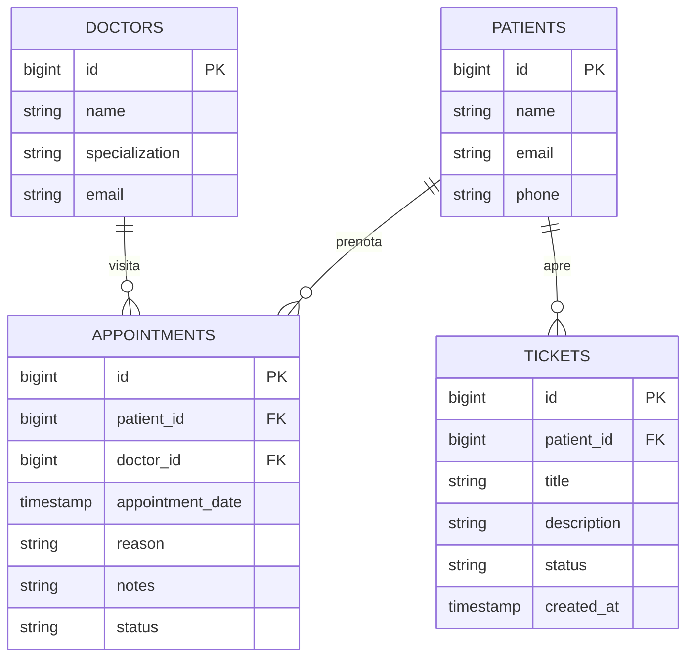

# Report Tecnico - Project Work L-31
## Applicazione Full-Stack per Clinica Polispecialistica "HealthCare Plus"

---

## 1. Contesto Aziendale e Scenario d'Uso

**HealthCare Plus** è una clinica medica privata polispecialistica che offre visite specialistiche in diversi settori (Cardiologia, Dermatologia, Pediatria, Ortopedia e Medicina Generale). La clinica gestisce quotidianamente un elevato flusso di prenotazioni, cartelle cliniche e richieste di supporto tecnico da parte dei pazienti.

> Nota: questa sezione è un riassunto esecutivo. La relazione completa e dettagliata, organizzata in 9 capitoli (contesto, design UML/ER, API/Swagger, repository Git, processo di sviluppo, test funzionali, pianificazione delle fasi, risorse utilizzate, valutazione critica dei risultati) è disponibile in [`doc/README.md`](./doc/README.md).

### Il Servizio Offerto
Per digitalizzare e semplificare i processi operativi, si è sviluppata un'applicazione web basata su un'architettura **API-oriented** che offre:
1.  **Portale Prenotazioni**: Consente ai pazienti di selezionare un medico in base alla specializzazione e scegliere uno slot orario tra quelli che il medico ha dichiarato disponibili per la data scelta (gli slot già occupati sono visibili ma non selezionabili), inviando una richiesta di prenotazione memorizzata a database.
2.  **Dashboard Personale**: Mostra la cronologia degli appuntamenti programmati, lo stato delle visite e le segnalazioni attive, oltre ai referti medici caricati dal medico e al piano terapeutico in corso.
3.  **Autenticazione e Sicurezza**: Login con **JWT stateless**, **2FA via TOTP** opzionale e controllo degli accessi basato sui ruoli (**RBAC**: Paziente, Medico, Supporto IT).
4.  **Gestione Referti e Terapie**: I medici caricano referti (PDF) e prescrivono terapie con data di inizio/fine, visibili al paziente in dashboard.
5.  **Sistema di Ticket IT**: Il personale di supporto gestisce e risolve le segnalazioni tecniche aperte dai pazienti.

---

## 2. Design dell'Architettura

L'applicazione segue un pattern architetturale a tre livelli (Three-Tier Architecture):
*   **Presentation Layer**: Client Single Page Application (SPA) in **Angular 19**.
*   **Application/Business Layer**: Backend RESTful in **Java 21 con Spring Boot 3**.
*   **Data Layer**: Database relazionale in-memory **H2 Database** gestito tramite Spring Data JPA.

### 2.1 Diagramma dei Casi d'Uso (UML Use Case)

```mermaid
leftToRightDirection
actor Paziente as "Paziente (Utente)"

rectangle "Sistema HealthCare Plus" {
  Paziente --> (Visualizza Medici)
  Paziente --> (Prenota Visita Medica)
  Paziente --> (Visualizza Dashboard Visite/Ticket)
  Paziente --> (Apre una Segnalazione)
}
```

### 2.2 Diagramma delle Classi ed Entità (Database ER)



### 2.3 Diagramma di Sequenza: Apertura di un Ticket

Il diagramma descrive lo scambio di messaggi quando un paziente segnala un problema tecnico dalla propria dashboard:

```mermaid
sequenceDiagram
    autonumber
    actor Utente as Paziente
    participant UI as Client Angular
    participant SB as Spring Boot Backend (Java)
    database DB as H2 Database

    Utente->>UI: Compila il form "Nuova segnalazione"
    UI->>SB: POST /api/tickets {patientId, title, description} (Bearer Token)
    SB->>SB: Verifica ownership (paziente autenticato = patientId)
    SB->>DB: Salva entità Ticket (Stato: OPEN)
    DB-->>SB: Conferma salvataggio (ID #1)
    SB-->>UI: Ritorna 201 Created (Dati Ticket)
    UI-->>Utente: Aggiorna la tabella "Le mie segnalazioni"
```

---

## 3. Documentazione delle API (REST)

Il backend Spring Boot espone la documentazione interattiva tramite **Swagger/OpenAPI** all'indirizzo `http://localhost:8080/swagger-ui.html`. Di seguito vengono riassunte le rotte principali (elenco completo di tutti i controller, incluse autenticazione e referti medici, in [`doc/3-API_Swagger.md`](./doc/3-API_Swagger.md)):

### 3.1 Servizio Appuntamenti (`/api/appointments`)
*   **`GET /api/appointments`**: Ritorna la lista di tutte le visite nel sistema.
*   **`GET /api/appointments/patient/{patientId}`**: Ritorna le visite specifiche di un paziente.
*   **`POST /api/appointments`**: Crea una nuova prenotazione.
    *   *Payload d'esempio*:
        ```json
        {
          "patientId": 1,
          "doctorId": 2,
          "appointmentDate": "2026-07-15T14:30:00",
          "reason": "Controllo dermatologico annuale",
          "notes": "Richiesta prima visita"
        }
        ```
*   **`PATCH /api/appointments/{id}/status`**: Aggiorna lo stato di una visita (`SCHEDULED`, `COMPLETED`, `CANCELLED`) tramite parametro di query `status`.

### 3.2 Servizio Supporto Tecnico (`/api/tickets`)
*   **`GET /api/tickets/patient/{patientId}`**: Restituisce tutti i ticket di un paziente.
*   **`POST /api/tickets`**: Crea un nuovo ticket nel DB.
    *   *Payload d'esempio*:
        ```json
        {
          "patientId": 1,
          "title": "Errore nel caricamento referti",
          "description": "Sezione documenti vuota dopo aver cliccato sull'appuntamento di ieri"
        }
        ```

---

## 4. Analisi degli Snippet Principali e Processo di Sviluppo

Il processo di sviluppo ha previsto prima la scrittura del backend Java per definire le entità base e i servizi REST, ed infine l'interfaccia client in Angular. Di seguito viene analizzato un passaggio chiave dello sviluppo:

### 4.1 Modulo Java: Mapping con MapStruct (`AppointmentMapper`)
Per mappare in modo pulito l'entità relazionale JPA `Appointment` al DTO utilizzato per le API REST, è stato configurato **MapStruct**. La classe converte gli ID ricevuti nel DTO nelle entità JPA reali e viceversa:

```java
package com.example.healthcare.mapper;

import com.example.healthcare.dto.AppointmentDTO;
import com.example.healthcare.entity.Appointment;
import org.mapstruct.Mapper;
import org.mapstruct.Mapping;

@Mapper(componentModel = "spring", uses = {PatientMapper.class, DoctorMapper.class})
public interface AppointmentMapper {
    @Mapping(source = "patient.id", target = "patientId")
    @Mapping(source = "doctor.id", target = "doctorId")
    AppointmentDTO toDto(Appointment appointment);

    @Mapping(source = "patientId", target = "patient.id")
    @Mapping(source = "doctorId", target = "doctor.id")
    Appointment toEntity(AppointmentDTO appointmentDto);
}
```
*Dettaglio interessante*: L'uso di `uses = {...}` permette di riutilizzare i mapper dei singoli modelli nidificati per esporre nel DTO sia gli ID piatti (`patientId`/`doctorId`) utili alla creazione, sia l'intero oggetto DTO nidificato (`patient`/`doctor`) visualizzato in lettura sul client.

---

## 5. Guida all'Avvio del Progetto

Il progetto è strutturato in modo da poter avviare i due moduli in parallelo.

### 5.1 Avvio del Backend (Java + Spring Boot)
1.  Entra nella cartella `backend/`.
2.  Esegui il compilato e avvia l'applicazione con Maven:
    ```bash
    /opt/homebrew/bin/mvn spring-boot:run
    ```
3.  L'applicazione sarà in ascolto su `http://localhost:8080`.
4.  Accedi alla console del database H2 su `http://localhost:8080/h2-console` (JDBC URL: `jdbc:h2:mem:healthcaredb`, username: `sa`, password vuota).
5.  Accedi a Swagger UI su `http://localhost:8080/swagger-ui.html`.

### 5.2 Avvio del Frontend (Angular)
1.  Entra nella cartella `frontend/`.
2.  Carica la versione corretta di Node ed avvia il server di sviluppo Angular:
    ```bash
    source ~/.nvm/nvm.sh
    npm start
    ```
3.  L'interfaccia utente sarà accessibile dal browser all'indirizzo `http://localhost:4200`.

---

## 6. Test Funzionali e Validazione

I moduli sono stati validati con successo:
1.  **Backend compilation**: Compilato con successo tramite Maven, includendo la generazione automatica delle classi dei mapper MapStruct.
2.  **Frontend build**: Compilato con successo superando i controlli di budget di Angular.

*Istruzioni per i test manuali*:
- Avviare i servizi come descritto nella sezione 5.
- Aprire `http://localhost:4200`, accedere come Paziente e aprire una nuova segnalazione dalla dashboard, verificandone la comparsa immediata nella tabella **Le mie segnalazioni**.
