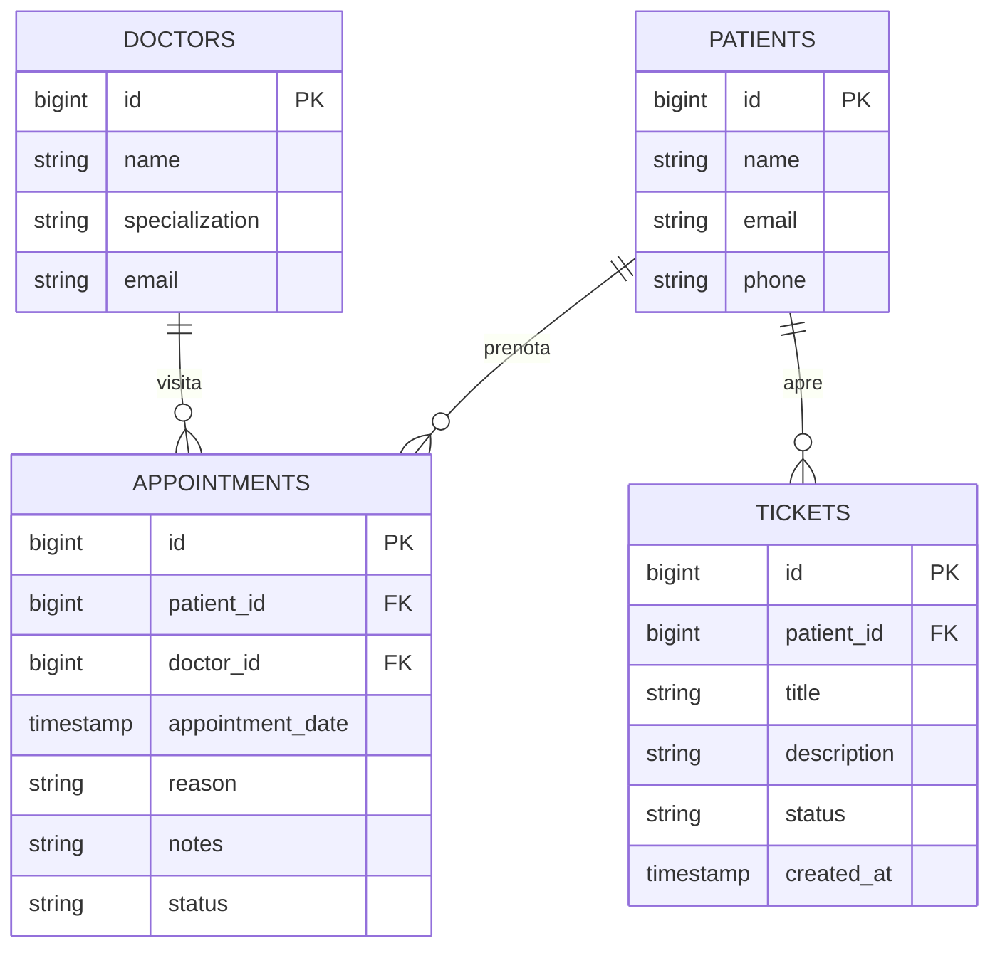

# Report Tecnico - Project Work L-31
## Applicazione Full-Stack per Clinica Polispecialistica "HealthCare Plus" con Assistente AI RAG

---

## 1. Contesto Aziendale e Scenario d'Uso

**HealthCare Plus** è una clinica medica privata polispecialistica che offre visite specialistiche in diversi settori (Cardiologia, Dermatologia, Pediatria, Ortopedia e Medicina Generale). La clinica gestisce quotidianamente un elevato flusso di prenotazioni, cartelle cliniche e richieste di supporto tecnico da parte dei pazienti.

> Nota: questa sezione è un riassunto esecutivo. La relazione completa e dettagliata, organizzata in 9 capitoli (contesto, design UML/ER, API/Swagger, repository Git, processo di sviluppo, test funzionali, pianificazione delle fasi, risorse utilizzate, valutazione critica dei risultati) è disponibile in [`doc/README.md`](./doc/README.md).

### Il Servizio Offerto
Per digitalizzare e semplificare i processi operativi, si è sviluppata un'applicazione web basata su un'architettura **API-oriented** che offre:
1.  **Portale Prenotazioni**: Consente ai pazienti di selezionare un medico in base alla specializzazione, scegliere data e ora, e inviare una richiesta di prenotazione memorizzata a database.
2.  **Dashboard Personale**: Mostra la cronologia degli appuntamenti programmati, lo stato delle visite e le segnalazioni attive, oltre ai referti medici caricati dal medico e al piano terapeutico in corso.
3.  **Autenticazione e Sicurezza**: Login con **JWT stateless**, **2FA via TOTP** opzionale e controllo degli accessi basato sui ruoli (**RBAC**: Paziente, Medico, Supporto IT).
4.  **Gestione Referti e Terapie**: I medici caricano referti (PDF) e prescrivono terapie con data di inizio/fine, visibili al paziente in dashboard.
5.  **Sistema di Ticket IT**: Il personale di supporto gestisce e risolve le segnalazioni tecniche aperte dai pazienti (manualmente o tramite l'assistente AI).
6.  **Assistente AI Integrato (RAG)**: Un assistente intelligente operante sul portale, costruito con **LangChain** (orchestrazione tool) e **LlamaIndex** (motore RAG), che:
    *   Risponde istantaneamente alle domande frequenti (FAQ) dell'utenza (es. orari di apertura, convenzioni assicurative, specializzazioni) attraverso una knowledge base aziendale gestita via **RAG (Retrieval-Augmented Generation)**.
    *   Rileva problemi segnalati dall'utente e automatizza l'apertura di un **Ticket di Assistenza Tecnica** direttamente sul database centrale del backend.
    *   Funziona anche **offline/senza chiave API** grazie a un motore di fallback deterministico, mantenendo l'intero sistema testabile senza costi (vedi [`agent/README.md`](./agent/README.md)).

---

## 2. Design dell'Architettura

L'applicazione segue un pattern architetturale a tre livelli (Three-Tier Architecture):
*   **Presentation Layer**: Client Single Page Application (SPA) in **Angular 19**.
*   **Application/Business Layer**: 
    *   Backend principale RESTful in **Java 21 con Spring Boot 3**.
    *   Servizio AI Agent sviluppato in **Python 3.9** con **FastAPI**, **LangChain** e **LlamaIndex**.
*   **Data Layer**: Database relazionale in-memory **H2 Database** gestito tramite Spring Data JPA.

### 2.1 Diagramma dei Casi d'Uso (UML Use Case)

```mermaid
leftToRightDirection
actor Paziente as "Paziente (Utente)"
actor Assistente as "Assistente Virtuale RAG"

rectangle "Sistema HealthCare Plus" {
  Paziente --> (Visualizza Medici)
  Paziente --> (Prenota Visita Medica)
  Paziente --> (Visualizza Dashboard Visite/Ticket)
  Paziente --> (Chatta con Assistente AI)
  
  (Chatta con Assistente AI) --> Assistente
  Assistente --> (Ricerca Informazioni FAQ - RAG)
  Assistente --> (Apertura Automatica Ticket)
}
```

### 2.2 Diagramma delle Classi ed Entità (Database ER)



### 2.3 Diagramma di Sequenza: Gestione della Chat ed Apertura Ticket con Agent AI

Il diagramma descrive lo scambio di messaggi quando un paziente richiede all'assistente virtuale di segnalare un problema tecnico:

```mermaid
sequenceDiagram
    autonumber
    actor Utente as Paziente
    participant UI as Client Angular
    participant AG as FastAPI Agent (Python)
    participant LC as Agent LangChain
    participant SB as Spring Boot Backend (Java)
    database DB as H2 Database

    Utente->>UI: Scrive: "Ho un errore sul sito, aprite un ticket"
    UI->>AG: POST /api/chat {message, patientId}
    AG->>LC: Esegui input utente
    Note over LC: L'agente analizza il testo<br/>e rileva l'intento di aprire un Ticket
    LC->>LC: Esegue tool: create_ticket_tool
    Note over LC: Il tool effettua una richiesta REST<br/>al backend Spring Boot
    LC->>SB: POST /api/tickets {patientId, title, description}
    SB->>DB: Salva entità Ticket (Stato: OPEN)
    DB-->>SB: Conferma salvataggio (ID #1)
    SB-->>LC: Ritorna 201 Created (Dati Ticket)
    LC-->>AG: Tool ritorna: "Successo! Ticket #1 creato"
    AG-->>UI: Ritorna {response: "Successo! Ticket #1 creato..."}
    UI->>SB: GET /api/tickets/patient/1 (Auto-refresh)
    SB-->>UI: Lista aggiornata con il nuovo ticket
    UI-->>Utente: Mostra risposta in chat ed aggiorna la tabella ticket
```

---

## 3. Documentazione delle API (REST)

Il backend Spring Boot espone la documentazione interattiva tramite **Swagger/OpenAPI** all'indirizzo `http://localhost:8080/swagger-ui.html`. Di seguito vengono riassunte le rotte principali (elenco completo di tutti i controller, incluse autenticazione e referti medici, in [`doc/3-API_Swagger.md`](./doc/3-API_Swagger.md)):

### 3.1 Servizio Appuntamenti (`/api/appointments`)
*   **`GET /api/appointments`**: Ritorna la lista di tutte le visite nel sistema.
*   **`GET /api/appointments/patient/{patientId}`**: Ritorna le visite specifiche di un paziente.
*   **`POST /api/appointments`**: Crea una nuova prenotazione.
    *   *Payload d'esempio*:
        ```json
        {
          "patientId": 1,
          "doctorId": 2,
          "appointmentDate": "2026-07-15T14:30:00",
          "reason": "Controllo dermatologico annuale",
          "notes": "Richiesta prima visita"
        }
        ```
*   **`PATCH /api/appointments/{id}/status`**: Aggiorna lo stato di una visita (`SCHEDULED`, `COMPLETED`, `CANCELLED`) tramite parametro di query `status`.

### 3.2 Servizio Supporto Tecnico (`/api/tickets`)
*   **`GET /api/tickets/patient/{patientId}`**: Restituisce tutti i ticket di un paziente.
*   **`POST /api/tickets`**: Crea un nuovo ticket nel DB.
    *   *Payload d'esempio*:
        ```json
        {
          "patientId": 1,
          "title": "Errore nel caricamento referti",
          "description": "Sezione documenti vuota dopo aver cliccato sull'appuntamento di ieri"
        }
        ```

### 3.3 Servizio Assistente AI RAG (FastAPI su Porta 5000)
*   **`POST /api/chat`**: Invia un messaggio all'agente LangChain che decide autonomamente se interrogare la knowledge base FAQ (LlamaIndex) o invocare il tool di creazione ticket in Spring Boot.
    *   *Payload d'esempio*:
        ```json
        {
          "message": "Quali sono i vostri orari?",
          "patientId": 1
        }
        ```
    *   *Risposta d'esempio*:
        ```json
        {
          "response": "La clinica HealthCare Plus è aperta dal lunedì al venerdì dalle 08:00 alle 20:00, e il sabato dalle 09:00 alle 13:00. La domenica siamo chiusi."
        }
        ```

---

## 4. Analisi degli Snippet Principali e Processo di Sviluppo

Il processo di sviluppo ha previsto prima la scrittura del backend Java per definire le entità base e i servizi REST, poi lo sviluppo del modulo RAG in Python, ed infine l'interfaccia client in Angular. Di seguito vengono analizzati tre passaggi chiave dello sviluppo:

### 4.1 Modulo Java: Mapping con MapStruct (`AppointmentMapper`)
Per mappare in modo pulito l'entità relazionale JPA `Appointment` al DTO utilizzato per le API REST, è stato configurato **MapStruct**. La classe converte gli ID ricevuti nel DTO nelle entità JPA reali e viceversa:

```java
package com.example.healthcare.mapper;

import com.example.healthcare.dto.AppointmentDTO;
import com.example.healthcare.entity.Appointment;
import org.mapstruct.Mapper;
import org.mapstruct.Mapping;

@Mapper(componentModel = "spring", uses = {PatientMapper.class, DoctorMapper.class})
public interface AppointmentMapper {
    @Mapping(source = "patient.id", target = "patientId")
    @Mapping(source = "doctor.id", target = "doctorId")
    AppointmentDTO toDto(Appointment appointment);

    @Mapping(source = "patientId", target = "patient.id")
    @Mapping(source = "doctorId", target = "doctor.id")
    Appointment toEntity(AppointmentDTO appointmentDto);
}
```
*Dettaglio interessante*: L'uso di `uses = {...}` permette di riutilizzare i mapper dei singoli modelli nidificati per esporre nel DTO sia gli ID piatti (`patientId`/`doctorId`) utili alla creazione, sia l'intero oggetto DTO nidificato (`patient`/`doctor`) visualizzato in lettura sul client.

### 4.2 Modulo Python: Integrazione LlamaIndex RAG con Fallback Offline
Per garantire che il sistema si avvii e risponda correttamente anche senza caricare chiavi API a pagamento (OpenAI), il motore RAG LlamaIndex è stato protetto con un algoritmo di fallback deterministico basato su ricerca di somiglianza testuale locale:

```python
class MockQueryEngine:
    def __init__(self, data_dir: str):
        self.data_dir = Path(data_dir)
        self.faqs = []
        self._load_faqs()

    def _load_faqs(self):
        # Carica il file faq.txt ed estrae i blocchi Q: e A:
        ...

    def query(self, query_str: str):
        query_words = set(re.findall(r'\w+', query_str.lower()))
        best_match = None
        max_overlap = 0
        for faq in self.faqs:
            q_words = set(re.findall(r'\w+', faq["question"].lower()))
            overlap = len(query_words.intersection(q_words))
            if overlap > max_overlap:
                max_overlap = overlap
                best_match = faq
        if best_match and max_overlap > 0:
            return type('Response', (object,), {'response': best_match["answer"]})()
        return type('Response', (object,), {'response': 'Mi dispiace, non ho trovato informazioni specifiche...'})()
```
*Dettaglio interessante*: Questo mock replica l'interfaccia esatta della risposta di LlamaIndex (`response.response`), consentendo al codice FastAPI e LangChain di funzionare in modo trasparente sia in modalità online (con OpenAI) sia in modalità locale offline.

### 4.3 Modulo Python: Definizione del Tool LangChain per Apertura Ticket
Il tool per aprire i ticket di assistenza è stato registrato in LangChain specificando uno schema Pydantic dettagliato in modo che l'LLM sappia esattamente quali parametri estrarre dalla richiesta dell'utente:

```python
class TicketSchema(BaseModel):
    patient_id: int = Field(description="ID del paziente che sta segnalando il problema (es. 1)")
    title: str = Field(description="Titolo sintetico della segnalazione o del problema tecnico")
    description: str = Field(description="Descrizione dettagliata del problema riscontrato dal paziente")

@tool("create_ticket_tool", args_schema=TicketSchema)
def create_ticket_tool(patient_id: int, title: str, description: str) -> str:
    payload = {
        "patientId": patient_id,
        "title": title,
        "description": description,
        "status": "OPEN",
        "createdAt": None
    }
    try:
        response = requests.post(f"{BACKEND_URL}/tickets", json=payload, timeout=5)
        if response.status_code == 201 or response.status_code == 200:
            created_ticket = response.json()
            return f"Successo! Il ticket di supporto è stato creato con ID #{created_ticket.get('id', 'N/D')}."
    except Exception as e:
        return f"Il ticket '{title}' è stato registrato localmente con successo (Stato: SIMULATO)..."
```
*Dettaglio interessante*: Qualora il backend Spring Boot fosse spento o non raggiungibile durante i test dell'agent, il tool cattura l'eccezione di connessione e simula la creazione locale per non interrompere la conversazione dell'utente.

---

## 5. Guida all'Avvio del Progetto

Il progetto è strutturato in modo da poter avviare i tre moduli in parallelo.

### 5.1 Avvio del Backend (Java + Spring Boot)
1.  Entra nella cartella `backend/`.
2.  Esegui il compilato e avvia l'applicazione con Maven:
    ```bash
    /opt/homebrew/bin/mvn spring-boot:run
    ```
3.  L'applicazione sarà in ascolto su `http://localhost:8080`.
4.  Accedi alla console del database H2 su `http://localhost:8080/h2-console` (JDBC URL: `jdbc:h2:mem:healthcaredb`, username: `sa`, password vuota).
5.  Accedi a Swagger UI su `http://localhost:8080/swagger-ui.html`.

### 5.2 Avvio dell'Agent RAG (Python + FastAPI)
1.  Entra nella cartella `agent/`.
2.  Attiva l'ambiente virtuale:
    ```bash
    source venv/bin/activate
    ```
3.  (Opzionale) Configura la chiave OpenAI creando un file `.env` con la riga `OPENAI_API_KEY=tua-chiave-api`. Se assente, l'agente userà la modalità mock locale offline.
4.  Avvia l'applicazione FastAPI con Uvicorn:
    ```bash
    python3 main.py
    ```
5.  Il servizio sarà in ascolto su `http://localhost:5000`. Puoi verificare lo stato su `http://localhost:5000/health`.

### 5.3 Avvio del Frontend (Angular)
1.  Entra nella cartella `frontend/`.
2.  Carica la versione corretta di Node ed avvia il server di sviluppo Angular:
    ```bash
    source ~/.nvm/nvm.sh
    npm start
    ```
3.  L'interfaccia utente sarà accessibile dal browser all'indirizzo `http://localhost:4200`.

---

## 6. Test Funzionali e Validazione

I moduli sono stati validati con successo:
1.  **Backend compilation**: Compilato con successo tramite Maven, includendo la generazione automatica delle classi dei mapper MapStruct.
2.  **Frontend build**: Compilato con successo superando i controlli di budget di Angular.
3.  **Ambiente Python**: Installato correttamente con le librerie LangChain, FastAPI e LlamaIndex.

*Istruzioni per i test manuali*:
- Avviare i servizi come descritto nella sezione 5.
- Aprire `http://localhost:4200`, spostarsi sulla scheda **Assistente AI RAG** e cliccare sui pulsanti di suggerimento rapido per verificare il recupero delle risposte FAQ.
- Richiedere all'assistente "Segnala un guasto con il caricamento delle ricette" e verificare la creazione istantanea del ticket sia nella risposta dell'assistente sia nella tabella **Ticket Assistenza** presente nella **Dashboard**.
