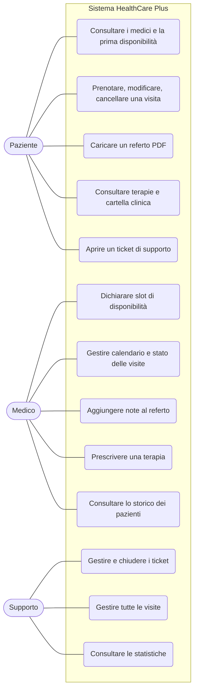

# 1. Contesto dell'Organizzazione e Servizi Offerti

[⬅ Torna all'Indice](./README.md) | [Avanti: Design Architetturale ➡](./2-Design_Architetturale.md)

## Il Contesto Operativo
**HealthCare Plus** è una clinica polispecialistica che offre visite in diversi ambiti (Cardiologia, Dermatologia, Pediatria, Ortopedia, Medicina Generale) e gestisce ogni giorno un flusso elevato di prenotazioni, documentazione clinica e richieste di assistenza da parte dei pazienti. Quando questi processi restano affidati a telefonate e carta, la clinica fatica a sapere quali visite sono libere, dove sia finito un referto o quale problema tecnico sia ancora aperto.

L'organizzazione ha quindi deciso di adottare una **piattaforma web unica**, accessibile ai pazienti e al personale interno con permessi differenziati per ruolo. Il progetto risponde alla traccia del Project Work (servizio digitale significativo per un'organizzazione sanitaria, architettura basata su API, backend RESTful, interfaccia intuitiva) con un'applicazione full-stack: un backend Spring Boot che espone le API e una SPA Angular che le consuma.

## Gli Attori e i Loro Permessi

| Attore | Chi è | Cosa può fare |
|---|---|---|
| **Paziente** (`PATIENT`) | Utente che si registra in autonomia dal portale | Consultare i medici e la loro prima disponibilità, prenotare, modificare o cancellare le **proprie** visite; caricare i propri referti in PDF; consultare terapie, referti e cartella clinica; aprire ticket di supporto; gestire profilo, password e 2FA |
| **Medico** (`DOCTOR`) | Specialista della clinica | Dichiarare la propria disponibilità (slot singoli o in serie); gestire il calendario e lo stato delle visite; leggere i referti dei propri appuntamenti e aggiungervi le note cliniche; prescrivere terapie; consultare lo storico dei pazienti; aggiornare il proprio profilo |
| **Supporto** (`SUPPORT`) | Personale amministrativo/IT | Vedere tutte le visite e tutti i ticket; cambiare lo stato di visite e ticket; creare medici e pazienti; consultare le statistiche generali |

Le regole precise, endpoint per endpoint, sono riportate nella [matrice dei permessi](./3-API_Swagger.md#matrice-dei-permessi) del capitolo 3. Il principio di fondo è che due utenti con lo stesso ruolo **non vedono i dati l'uno dell'altro**: un paziente accede solo alle proprie risorse, un medico solo a quelle dei propri appuntamenti.

*Tutti e tre gli attori accedono tramite login (con 2FA opzionale); la registrazione autonoma è riservata ai pazienti.*

## I Servizi Offerti

Il portale copre due aree complementari.

### 1. Gestione clinica di pazienti e medici

- **Prenotazione in base alla disponibilità reale.** Il medico dichiara gli slot in cui è disponibile; il paziente sceglie medico, data e uno slot libero (quelli già occupati sono visibili ma non selezionabili). L'elenco dei medici mostra per ciascuno il «primo slot libero», così da confrontare la disponibilità senza aprire ogni scheda.
- **Gestione delle visite.** Il paziente può modificare o cancellare le proprie visite finché sono programmate; il medico e il supporto ne gestiscono lo stato (`SCHEDULED` → `COMPLETED` / `CANCELLED`).
- **Referti.** Il **paziente** carica un referto in formato PDF associato a una visita. Il sistema ne estrae alcuni valori ematici (funzione oggi **simulata**, si veda il [capitolo 9](./9-Valutazione_Risultati.md)); il **medico** dell'appuntamento legge il referto e aggiunge le proprie note conclusive, e a quel punto la visita risulta completata.
- **Terapie.** Il medico prescrive terapie con data di inizio e fine, opzionalmente collegate alla visita in cui sono nate; il paziente le vede nella propria area «Le mie terapie».
- **Cartella clinica e stampa.** Il paziente raccoglie i propri documenti nella «Cartella clinica» ed esporta un riepilogo stampabile (funzione di stampa del browser).
- **Sicurezza dell'account.** Registrazione, login con JWT, cambio password e **autenticazione a due fattori (TOTP)** attivabile in autonomia dal profilo.

### 2. Sistema di Ticket IT (Supporto)

Il paziente segnala un problema tecnico dalla propria area «Assistenza»; il personale di **Supporto** vede le segnalazioni di tutti, le prende in carico e le chiude. Un pannello con contatori e filtri (aperti/chiusi, programmate/completate/cancellate) dà una vista d'insieme.

## Cosa non è incluso

Per mantenere il progetto circoscritto non sono previsti: pagamenti, notifiche email/SMS di promemoria, videoconsulto, integrazione con sistemi sanitari esterni, estrazione dati con OCR/IA reale. Alcuni sono discussi come sviluppi futuri nel [capitolo 9](./9-Valutazione_Risultati.md#sviluppi-futuri).

[Avanti: Design Architetturale ➡](./2-Design_Architetturale.md)
