# 2. Design Architetturale

[⬅ Indice](./README.md) | [Avanti: API Swagger ➡](./3-API_Swagger.md)

I diagrammi **UML** del progetto sono: casi d'uso ([capitolo 1](./1-Contesto_e_Servizi.md)), classi (§2.4) e sequenza (§2.7–2.11); il modello dati è rappresentato con il diagramma **Entità-Relazione** (§2.1). In questa sezione vengono presentati i modelli concettuali e di sistema adottati: il modello dati (§2.1), l'architettura a livelli e di deployment (§2.2–2.3), i pattern e la sicurezza del backend (§2.4–2.5), la struttura del frontend (§2.6) e i diagrammi di sequenza dei flussi principali (§2.7–2.11).

## 2.1 Diagramma Entità-Relazione (ER)

Il modello dati ruota attorno a sette entità di dominio più l'account di accesso (`AppUser`). Il diagramma rappresenta le associazioni persistite dal database:

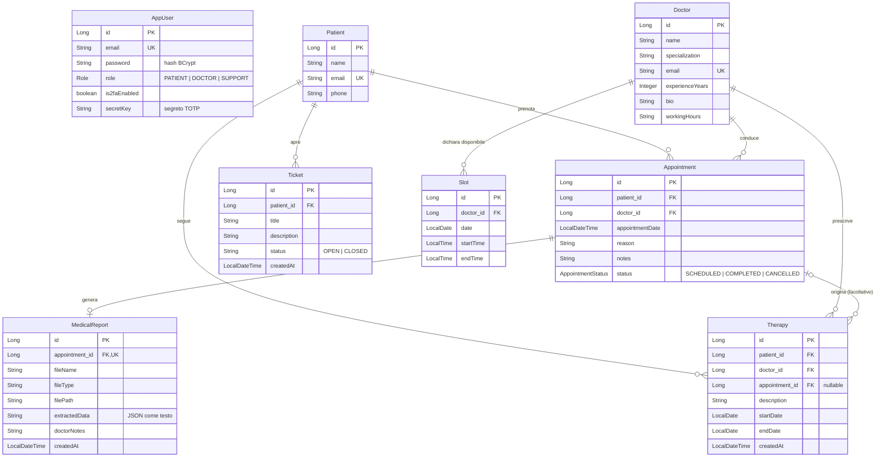

Scelte di modellazione che il diagramma da solo non mostra:

- **`AppUser` non ha una chiave esterna verso `Patient`/`Doctor`**: il collegamento tra account e profilo avviene tramite l'**email** (univoca in entrambe le tabelle). `OwnershipService` risolve l'identità dell'utente autenticato proprio con `findByEmail`. Il personale di Supporto ha un account ma nessuna riga di profilo.
- **`Slot` non ha una colonna «prenotato/libero»**: la disponibilità è calcolata a lettura incrociando gli appuntamenti del medico su quella data e fascia oraria (`SlotService.isBooked`, escludendo quelli `CANCELLED`). Un appuntamento cancellato libera lo slot automaticamente, senza sincronizzare due tabelle.
- **`Therapy → Appointment` è facoltativo** (`appointment_id` nullable): una terapia può nascere da una visita precisa oppure essere prescritta senza collegamento. Quando il collegamento c'è, `TherapyService` verifica che l'appuntamento appartenga allo stesso paziente e allo stesso medico, altrimenti risponde 400.
- **`MedicalReport.appointment_id` è univoco**: un solo referto per visita.
- **`Ticket.status` è una stringa** (`OPEN`/`CLOSED`), non un enum: è una scelta semplice ma meno rigorosa di quella usata per `AppointmentStatus`.

## 2.2 Architettura a livelli (C4)

### Contesto

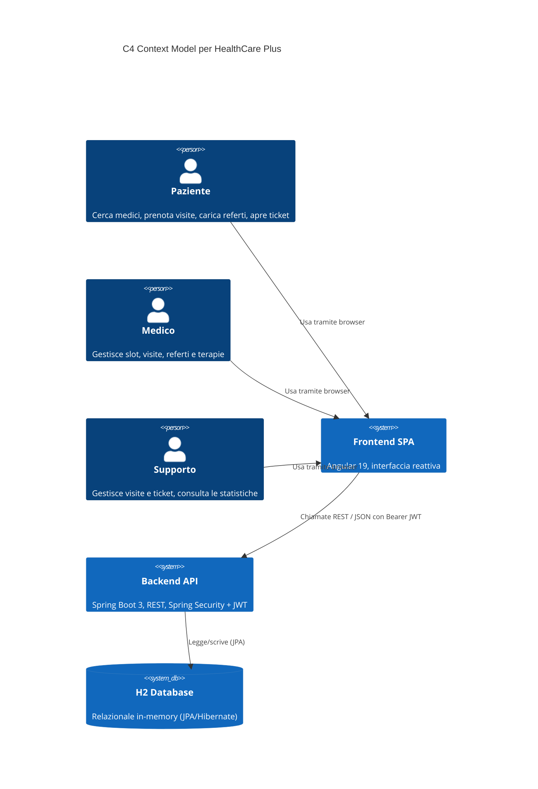

### Container

L'applicazione segue un'architettura **a tre livelli** (presentazione, logica applicativa, dati). Il file system locale ospita inoltre i PDF dei referti: non sono nel database, che conserva solo nome e percorso.

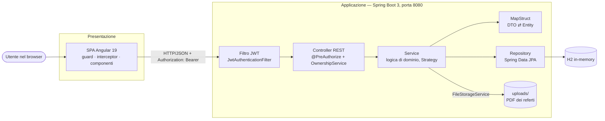

## 2.3 Modalità di deployment

Lo stesso codice si avvia in due modi, descritti operativamente nel [capitolo 4](./4-Repository_Git.md#due-modi-di-eseguire-lapplicazione):

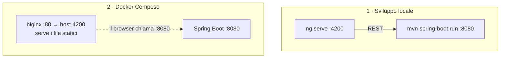

In entrambe le modalità il browser chiama il backend all'indirizzo configurato in `environment.backendUrl` (`http://localhost:8080/api`, sia in sviluppo sia in produzione, si veda [capitolo 9](./9-Valutazione_Risultati.md)).

## 2.4 Struttura del backend e Strategy pattern

Il backend è organizzato per responsabilità (`controller → service → repository`), con i **DTO come record Java immutabili** al confine tra livello REST e livello di persistenza, mappati con MapStruct. Gli errori sono tradotti da un `GlobalExceptionHandler` in risposte **RFC 7807 (`ProblemDetail`)**.

Le transizioni di stato di appuntamenti e ticket usano lo **Strategy pattern**: ogni stato ha la propria strategia e una *Factory* raccoglie automaticamente tutte le implementazioni presenti nel contesto Spring.

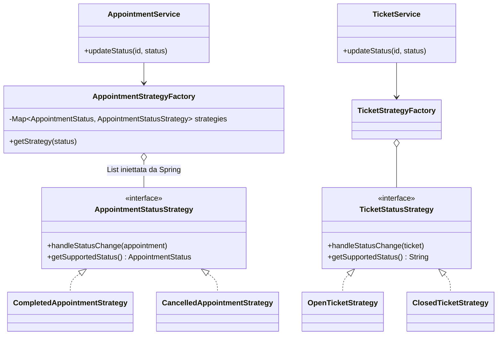

Aggiungere un nuovo stato (ad esempio `NO_SHOW`) richiede solo una nuova classe `@Component` che implementa l'interfaccia, senza toccare il codice esistente (Open/Closed Principle). **Nota di onestà:** al momento le strategie esistenti sono *punti di estensione*: `handleStatusChange` scrive un log e contiene commenti su notifiche/rimborsi ancora da implementare, non eseguono logica di business ulteriore. La suite di test verifica che la Factory restituisca la strategia corretta per ogni stato.

## 2.5 Sicurezza

La protezione avviene su **tre livelli**, dal più grossolano al più fine:

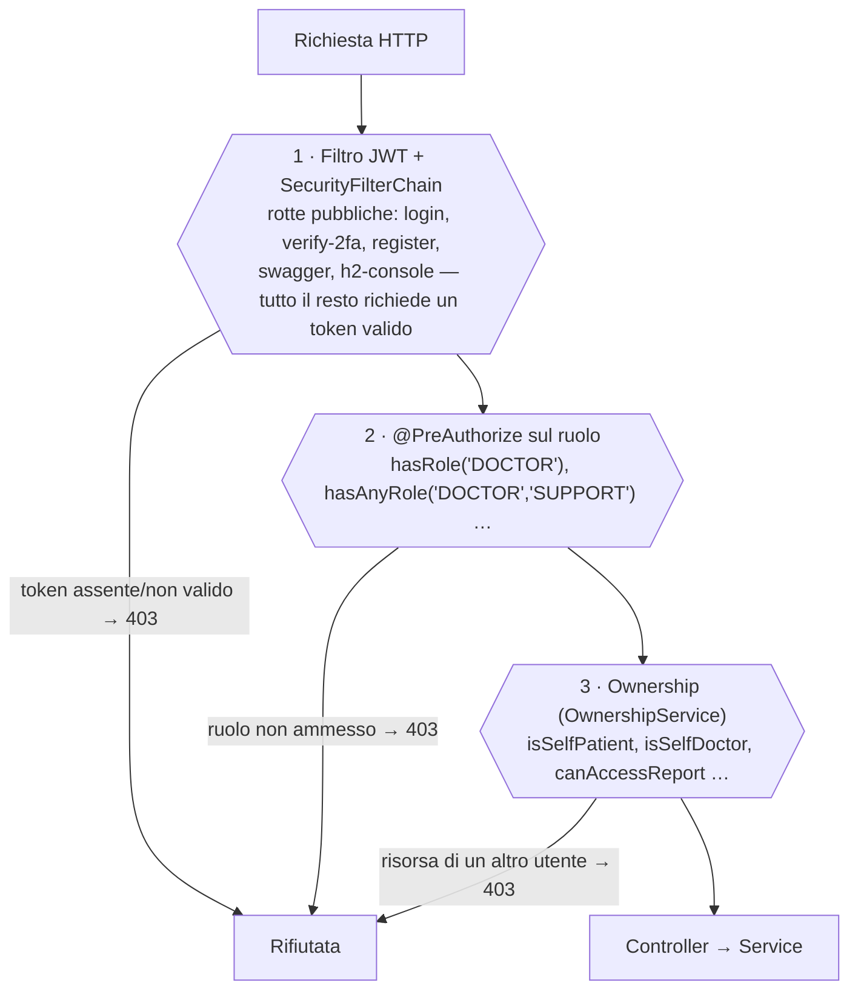

- **Autenticazione stateless.** Al login il backend firma un JWT (HS512, scadenza 24 h, soggetto = email). Il filtro `JwtAuthenticationFilter` lo valida a ogni richiesta e popola il `SecurityContext`; non esiste sessione lato server.
- **2FA opzionale (TOTP, RFC 6238).** Il segreto viene generato in `GET /api/auth/2fa/setup` (con QR code) e la 2FA si attiva solo dopo aver verificato un primo codice valido.
- **Ownership centralizzata.** Le regole a grana fine vivono in un unico bean (`@Component("ownership")`) richiamato dalle espressioni SpEL di `@PreAuthorize`, invece di essere ripetute in ogni service.
- **Password** con BCrypt; **CORS** aperto a tutte le origini (`*`) — adatto a un ambiente di sviluppo, da restringere in produzione (si veda il [capitolo 9](./9-Valutazione_Risultati.md#limiti-noti)).

## 2.6 Architettura del frontend

La SPA usa **componenti standalone** (nessun `NgModule`) e un router con guardie che rispecchiano lato client le regole del server. Le guardie migliorano l'esperienza d'uso ma **non** sono una barriera di sicurezza: ogni endpoint verifica comunque ruolo e ownership.

| Rotta | Guardie | Ruoli ammessi | Contenuto |
|---|---|---|---|
| `/` | `guestGuard` | ospiti | Landing page (chi è già loggato va in dashboard) |
| `/account` | — | tutti | Login/registrazione se ospite; profilo e sicurezza (2FA, password) se loggato |
| `/dashboard` | `authGuard` | tutti | Dashboard specifica per ruolo (paziente, medico, supporto) |
| `/booking` | `authGuard`, `roleGuard` | `PATIENT`, `SUPPORT` | Elenco medici → dettaglio → form di prenotazione con slot |
| `/therapy` | `authGuard`, `roleGuard` | `PATIENT` | Terapie prescritte |
| `/records` | `authGuard`, `roleGuard` | `PATIENT` | Cartella clinica e referti |
| `/support` | `authGuard`, `roleGuard` | `PATIENT` | Apertura e consultazione dei ticket |
| `/patients` | `authGuard`, `roleGuard` | `DOCTOR` | Elenco pazienti e storico clinico |

Altri elementi strutturali:

- **`AppStateService`** raccoglie lo stato condiviso tra le pagine (profilo corrente, medici, appuntamenti, ticket) e lo carica dopo il login, in modo che i componenti di presentazione restino semplici.
- **Tre interceptor HTTP**, registrati in quest'ordine in `app.config.ts`: `authInterceptor` (aggiunge `Authorization: Bearer …` solo alle richieste dirette al backend), `loadingInterceptor` (spinner globale con ritardo di 300 ms) ed `errorInterceptor` (Toast per gli errori, con eccezioni per le chiamate «silenziose» di login/registrazione).
- **Token JWT in `localStorage`**, insieme a email, ruolo e `profileId`.

## 2.7 Sequenza: prenotazione di una visita

Il paziente sceglie uno slot tra quelli dichiarati dal medico. Il flag `booked` è calcolato dal backend a ogni lettura.

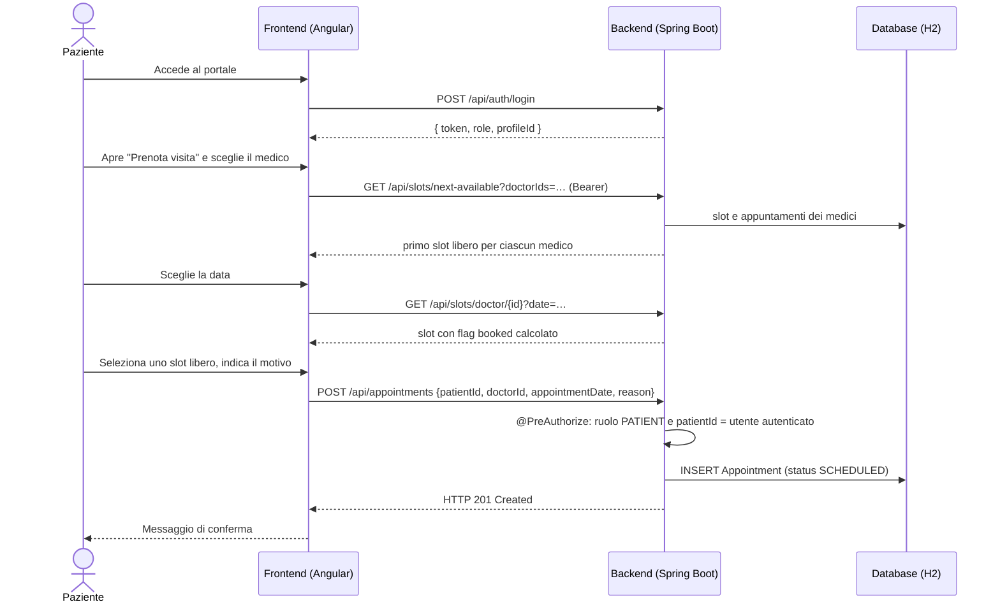

## 2.8 Sequenza: caricamento di un referto

Il referto lo carica il **paziente**; il **medico** lo consulta e lo chiude con le proprie note, che portano la visita a `COMPLETED`.

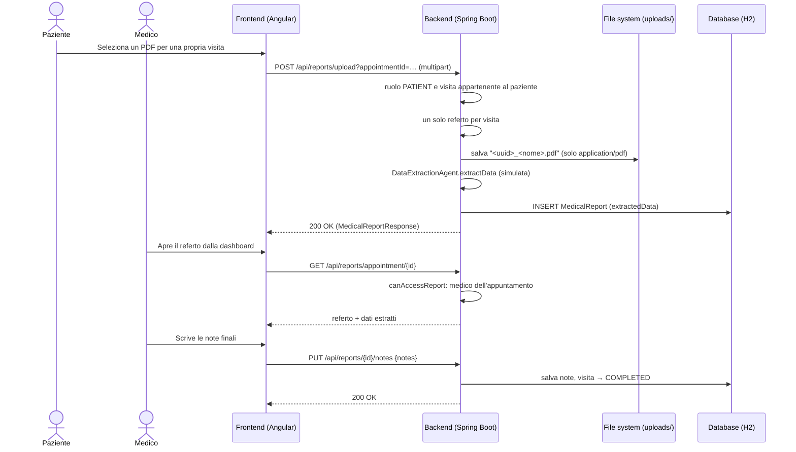

## 2.9 Sequenza: apertura di un ticket

Il backend verifica che il `patientId` indicato nella richiesta coincida con l'utente autenticato prima di salvare.

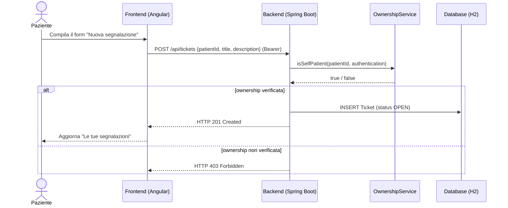

## 2.10 Sequenza: login con autenticazione a due fattori

Con la 2FA attiva il login avviene in **due chiamate**: la prima verifica la password e segnala che serve il secondo fattore, **senza emettere token**; la seconda verifica il codice TOTP ed emette il JWT. Poiché non c'è sessione lato server, il secondo passaggio non ripresenta la password: è un compromesso noto (si veda [capitolo 5](./5-Processo_Sviluppo.md#4-autenticazione-a-due-fattori-in-un-sistema-stateless) e [capitolo 9](./9-Valutazione_Risultati.md#limiti-noti)).

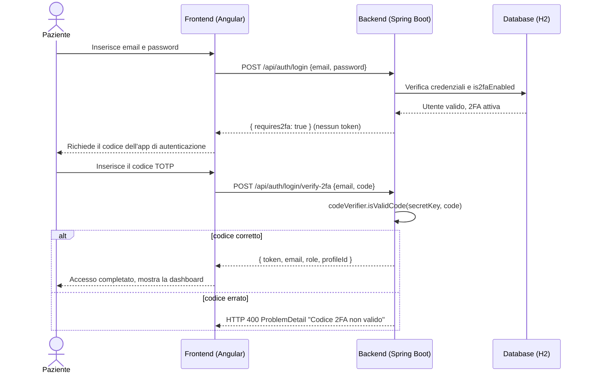

## 2.11 Sequenza: generazione di slot in serie

Il medico indica una fascia oraria e una durata; il backend genera gli slot consecutivi saltando quelli che si sovrapporrebbero a slot esistenti e li restituisce esplicitamente in `skipped`.

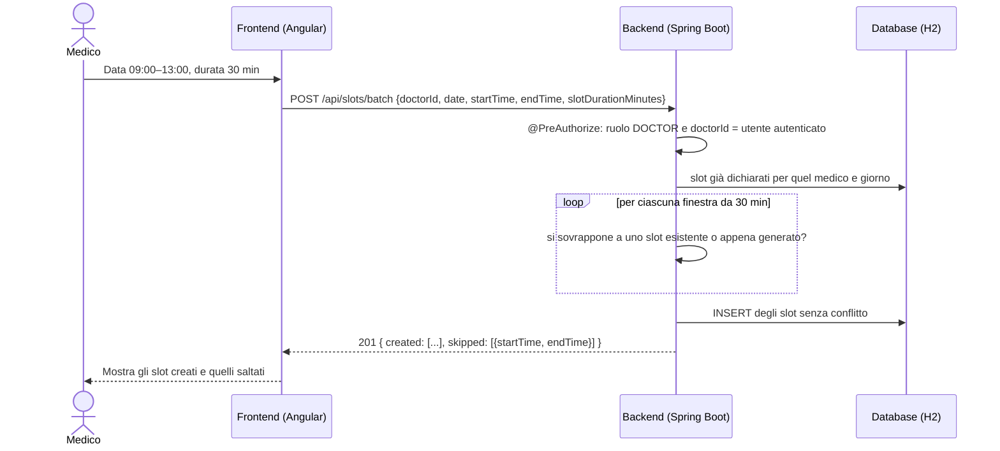

[Avanti: API Swagger ➡](./3-API_Swagger.md)
