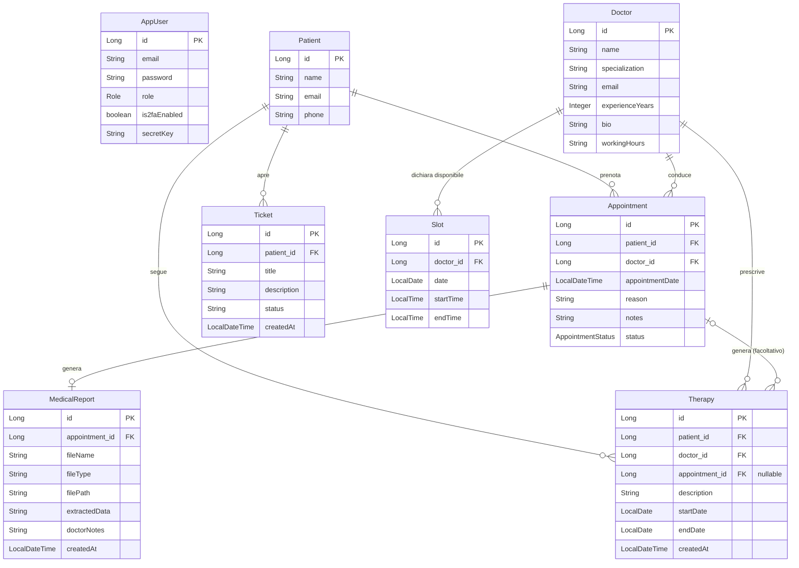
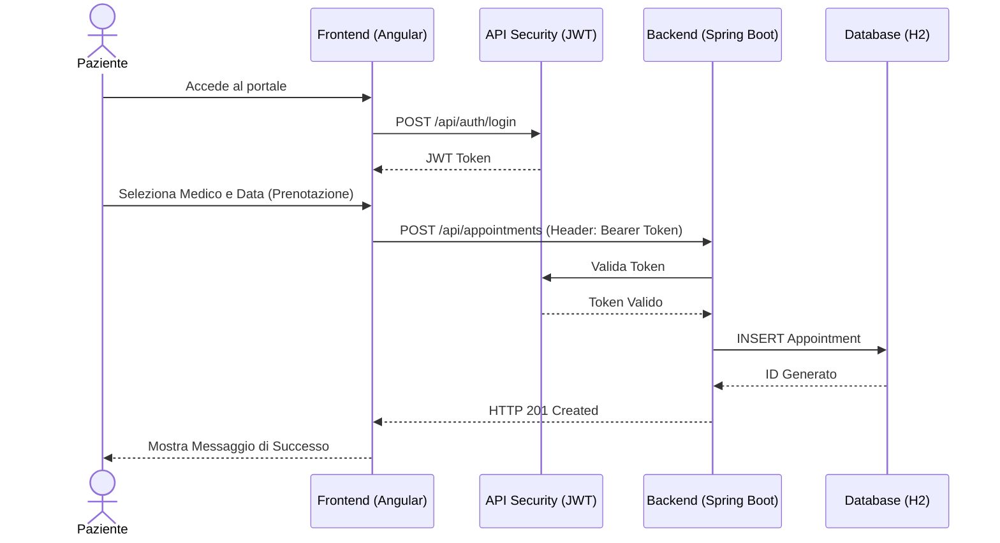
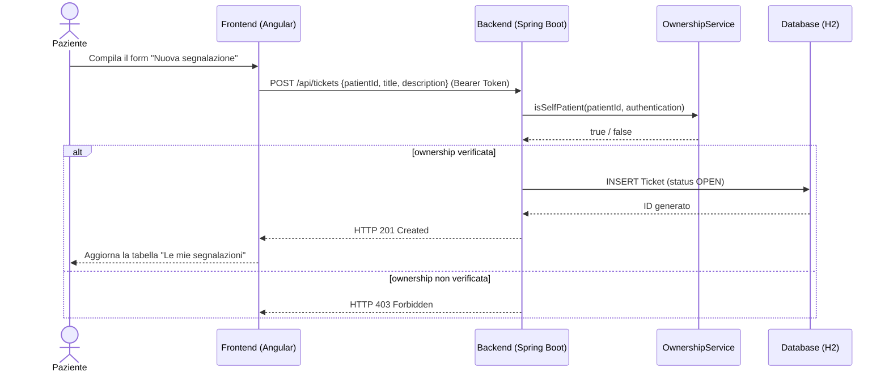
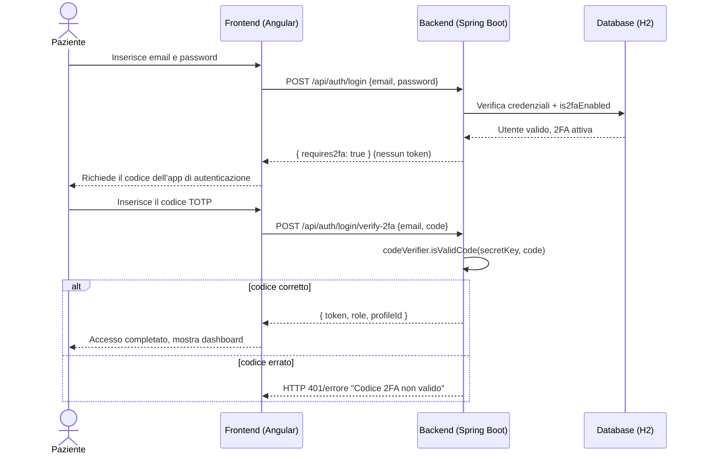
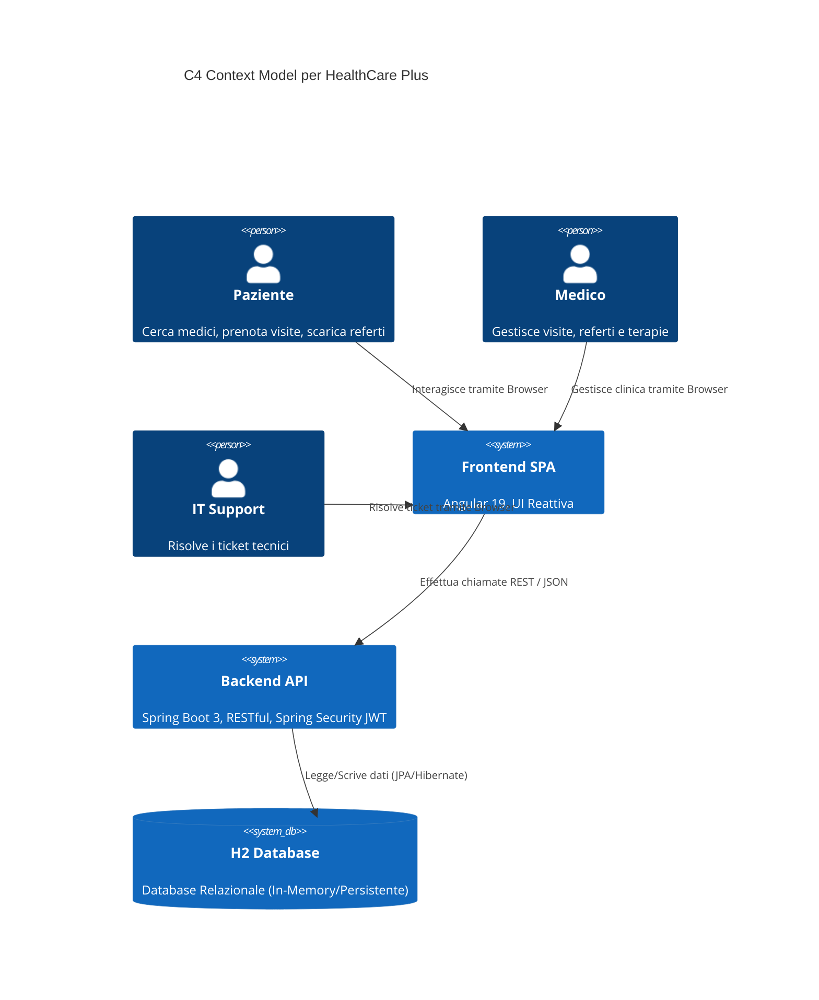

# 2. Design Architetturale

[⬅ Indice](./README.md) | [Avanti: API Swagger ➡](./3-API_Swagger.md)

In questa sezione vengono presentati i modelli concettuali e di sistema adottati.

## 2.1 Diagramma Entità-Relazione (ER)
Il modello dati è costruito attorno all'utente base (`AppUser`) dal quale ereditano, a livello logico/di ruolo, il `Patient`, il `Doctor` e il personale di supporto (tramite enumeratore `Role`).
Di seguito il diagramma ER che rappresenta le associazioni principali del database:

`Slot` non ha una colonna di stato "prenotato/libero": la disponibilità viene calcolata a lettura incrociando gli `Appointment` del medico su quella data/orario (`SlotService.isBooked`), così un appuntamento cancellato libera lo slot automaticamente senza bisogno di sincronizzare due tabelle.

Il collegamento `Therapy → Appointment` è facoltativo (`appointment_id` nullable): una terapia prescritta dalla riga di un appuntamento specifico lo referenzia, ma una terapia assegnata direttamente da un paziente (senza passare da una visita puntuale) resta valida senza il collegamento. `TherapyService` valida che l'appuntamento indicato appartenga effettivamente allo stesso paziente e medico della terapia, per evitare collegamenti incoerenti.

## 2.2 UML Sequence Diagram (Flusso di Prenotazione)
Il seguente diagramma di sequenza illustra il flusso per la prenotazione di una visita medica, evidenziando il ruolo del sistema di autenticazione (JWT).

## 2.3 UML Sequence Diagram (Apertura di un Ticket)
Il paziente apre una segnalazione tecnica dalla propria dashboard; il backend verifica che l'ID paziente indicato nella richiesta corrisponda all'utente autenticato (`@ownership.isSelfPatient`) prima di salvare il ticket:

## 2.4 UML Sequence Diagram (Login con Autenticazione a Due Fattori)
Quando un utente ha la 2FA attiva, il login avviene in due chiamate separate: la prima verifica la password e segnala che serve il secondo fattore, senza emettere alcun token; la seconda verifica il codice TOTP e genera il token JWT. Non essendoci sessione lato server, il secondo passaggio non ripresenta la password — un compromesso di un sistema stateless discusso in `REPORT.md` (§4) e in `doc/9-Valutazione_Risultati.md`.

## 2.5 C4 Model (Context Diagram)
Un diagramma di contesto C4 per rappresentare l'architettura macroscopica del progetto monorepo:

