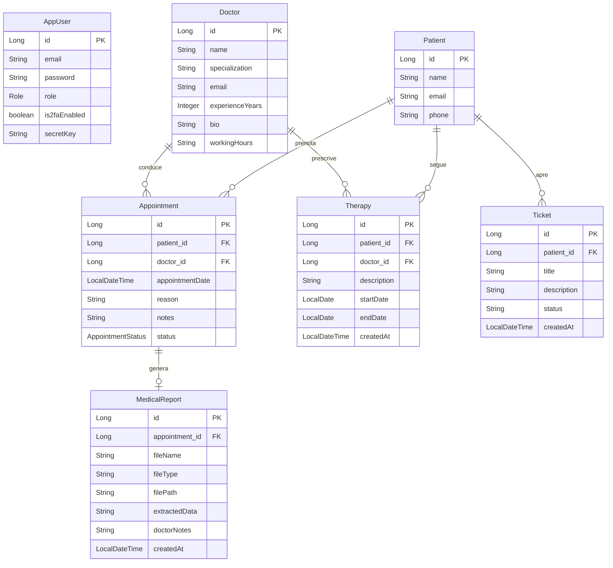
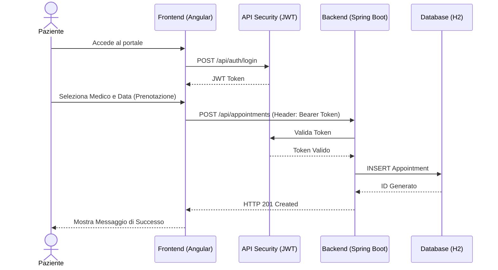

# 2. Design Architetturale

[⬅ Indice](./README.md) | [Avanti: API Swagger ➡](./3-API_Swagger.md)

In questa sezione vengono presentati i modelli concettuali e di sistema adottati.

## 2.1 Diagramma Entità-Relazione (ER)
Il modello dati è costruito attorno all'utente base (`AppUser`) dal quale ereditano, a livello logico/di ruolo, il `Patient`, il `Doctor` e il personale di supporto (tramite enumeratore `Role`).
Di seguito il diagramma ER che rappresenta le associazioni principali del database:



## 2.2 UML Sequence Diagram (Flusso di Prenotazione)
Il seguente diagramma di sequenza illustra il flusso per la prenotazione di una visita medica, evidenziando il ruolo del sistema di autenticazione (JWT).



## 2.3 C4 Model (Context Diagram)
Un diagramma di contesto C4 per rappresentare l'architettura macroscopica del progetto monorepo:

```mermaid
C4Context
    title C4 Context Model per HealthCare Plus

    Person(patient, "Paziente", "Cerca medici, prenota visite, scarica referti")
    Person(doctor, "Medico", "Gestisce visite, referti e terapie")
    Person(support, "IT Support", "Risolve i ticket tecnici")

    System(frontend, "Frontend SPA", "Angular 19, UI Reattiva")
    System(backend, "Backend API", "Spring Boot 3, RESTful, Spring Security JWT")
    SystemDb(database, "H2 Database", "Database Relazionale (In-Memory/Persistente)")
    
    SystemExt(ai_agent, "OpenAI / AI RAG", "Motore LLM per l'assistente virtuale (fallback offline se assente API key)")

    Rel(patient, frontend, "Interagisce tramite Browser")
    Rel(doctor, frontend, "Gestisce clinica tramite Browser")
    Rel(support, frontend, "Risolve ticket tramite Browser")

    Rel(frontend, backend, "Effettua chiamate REST / JSON")
    Rel(backend, database, "Legge/Scrive dati (JPA/Hibernate)")
    Rel(backend, ai_agent, "Interroga tramite API l'agente per il recupero dati (RAG)")
```
