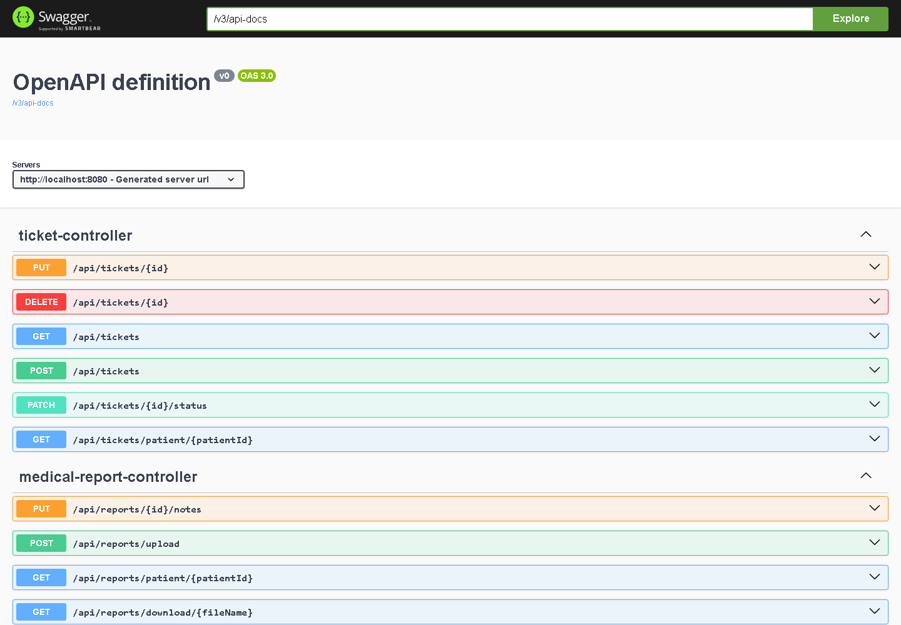
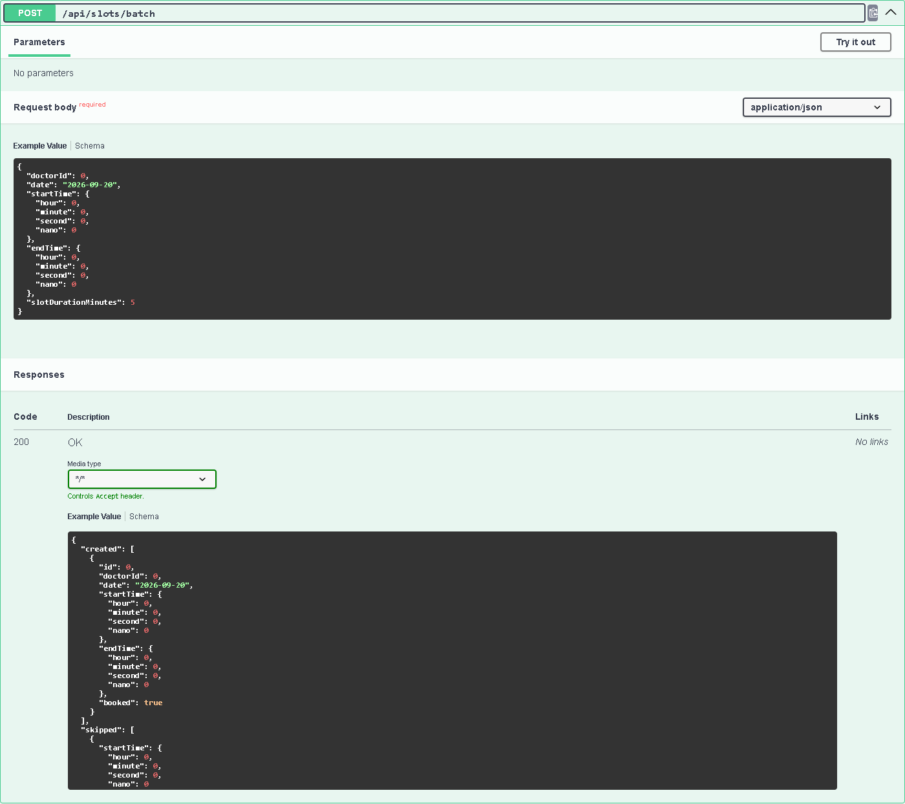

# 3. API e Documentazione Swagger

[⬅ Indice](./README.md) | [Avanti: Repository Git ➡](./4-Repository_Git.md)

Il backend espone un'interfaccia RESTful composta da **9 controller, 40 operazioni e 22 schemi** (conteggi ricavati dal documento OpenAPI generato dall'applicazione in esecuzione).

## Configurazione Swagger Dinamica
La documentazione è generata a runtime da **Springdoc OpenAPI** analizzando i controller annotati con `@RestController`: non esiste una specifica scritta a mano che possa disallinearsi dal codice.

- Interfaccia interattiva: 👉 `http://localhost:8080/swagger-ui.html`
- Documento OpenAPI 3 in JSON: 👉 `http://localhost:8080/v3/api-docs`

I percorsi di Swagger (`/swagger-ui/**`, `/swagger-ui.html`, `/v3/api-docs/**`) sono in whitelist (`.permitAll()`) nel `SecurityConfig`, così la documentazione è consultabile senza login.


*Swagger UI generata dall'applicazione: un gruppo per ciascun controller.*


*Dettaglio di un'operazione con schema di richiesta e risposta (`created` / `skipped`).*

### Limiti della documentazione generata

Tre aspetti vanno tenuti presenti quando si usa Swagger UI, perché derivano dalla configurazione di default di Springdoc:

1. **Nessuno schema di sicurezza dichiarato.** Il documento OpenAPI non contiene `securitySchemes`, quindi Swagger UI non mostra il pulsante *Authorize* e non può inviare il token JWT: dalla UI si possono provare solo gli endpoint pubblici. Per gli altri si usa un client (curl, Postman) con l'header `Authorization: Bearer <token>`, come negli esempi sotto.
2. **Tipi orari mostrati come oggetti.** L'esempio di `LocalTime` compare come `{hour, minute, second, nano}`, mentre sulla rete il formato corretto è una stringa, ad esempio `"09:00"`.
3. **Codici di risposta.** Springdoc dichiara `200` anche per le operazioni che in realtà rispondono `201` (ad esempio la creazione di slot e appuntamenti): fanno fede le tabelle di questo capitolo.

## Convenzioni comuni

- **Autenticazione:** header `Authorization: Bearer <JWT>` su tutte le rotte tranne `POST /api/auth/register`, `POST /api/auth/login`, `POST /api/auth/login/verify-2fa` e la documentazione Swagger.
- **Formato:** JSON; date `YYYY-MM-DD`, data-ora `YYYY-MM-DDTHH:mm:ss`, ora `HH:mm`. Il caricamento dei referti usa `multipart/form-data`.
- **Errori (RFC 7807).** Tutti gli errori hanno la forma di un `ProblemDetail`:

  ```json
  {
    "type": "about:blank",
    "title": "Bad Request",
    "status": 400,
    "detail": "Sono ammessi solo referti in formato PDF",
    "instance": "/api/reports/upload"
  }
  ```

  | Situazione | Stato | Note |
  |---|---|---|
  | Regola di business violata (es. slot già prenotato, email già in uso, credenziali errate) | `400` | `detail` contiene il messaggio in italiano |
  | Validazione dei DTO fallita (`@Valid`) | `400` | `title: "Validation Error"`, mappa `validationErrors` campo → messaggio |
  | Token assente, non valido **o scaduto** | `403` | Spring Security risponde `403` anche per l'assenza di autenticazione: non viene mai restituito `401` |
  | Ruolo o ownership non sufficienti | `403` | `detail: "Non hai i permessi per accedere a questa risorsa"` |
  | Errore imprevisto | `500` | Messaggio generico, senza dettagli interni |

## Matrice dei permessi

Legenda: **P** = Paziente, **M** = Medico, **S** = Supporto. «Proprio» significa che la risorsa deve appartenere all'utente autenticato (`OwnershipService`). «Autenticato» significa qualunque utente con token valido.

### AuthController — `/api/auth`

| Operazione | Chi | Note |
|---|---|---|
| `POST /register` | Pubblico | Crea account e profilo **paziente**; password cifrata con BCrypt. `400` se l'email esiste già |
| `POST /login` | Pubblico | Risponde `{token, email, role, profileId, requires2fa}`. Con 2FA attiva risponde `requires2fa: true` **senza token** |
| `POST /login/verify-2fa` | Pubblico | Riceve `{email, code}` e, se il codice TOTP è valido, emette il token |
| `GET /2fa/setup` | Autenticato | Genera un nuovo segreto e il QR code (data URI) |
| `POST /2fa/enable` | Autenticato | Attiva la 2FA verificando un primo codice `{code}` |
| `PUT /password` | Autenticato | `{oldPassword, newPassword}`; `400` se la vecchia password è errata |

### AppointmentController — `/api/appointments`

| Operazione | Chi | Note |
|---|---|---|
| `GET /` | M, S | Tutte le visite |
| `GET /patient/{patientId}` | M, S, oppure P proprietario | Visite di un paziente |
| `POST /` | M, S, oppure P per **sé stesso** | `patientId` nel corpo deve coincidere con l'utente se è un paziente. Risponde `201`. Nell'interfaccia il Medico crea visite dal form «Nuovo appuntamento» (con scelta del paziente); per il Supporto il form di prenotazione non prevede la scelta del paziente (L15) |
| `PUT /{id}` | M, S, oppure P proprietario | Modifica data, motivo, note; solo se la visita è ancora `SCHEDULED` |
| `PATCH /{id}/status?status=…` | M, S per ogni stato; P proprietario **solo** `CANCELLED` | `SCHEDULED`, `COMPLETED`, `CANCELLED`; applica lo Strategy pattern |
| `DELETE /{id}` | M, S | |

### DoctorController — `/api/doctors`

| Operazione | Chi | Note |
|---|---|---|
| `GET /` , `GET /{id}` | Autenticato | Elenco e scheda dei medici |
| `POST /` | S | Crea un medico |
| `PUT /{id}` | S, oppure M proprietario | Aggiorna il profilo |

### PatientController — `/api/patients`

| Operazione | Chi | Note |
|---|---|---|
| `GET /` | M, S | Elenco pazienti |
| `GET /{id}` | M, S, oppure P proprietario | |
| `POST /` | S | |
| `PUT /{id}` | S, oppure P proprietario | |

### MedicalReportController — `/api/reports`

| Operazione | Chi | Note |
|---|---|---|
| `POST /upload?appointmentId={id}` | P | Multipart, campo `file`. Solo PDF (`400` per altri formati); il paziente deve essere quello della visita; un solo referto per visita. Popola `extractedData` tramite l'agente (simulato) |
| `PUT /{id}/notes` | M | Corpo `{"notes": "…"}`. Il medico deve essere quello della visita; porta la visita a `COMPLETED` |
| `GET /appointment/{appointmentId}` | S, oppure paziente/medico di quella visita | |
| `GET /patient/{patientId}` | P proprietario | Tutti i referti del paziente |
| `GET /download/{fileName}` | S, oppure paziente/medico del referto | Restituisce il PDF. Richiede l'header `Authorization`: non è utilizzabile con un semplice link nel browser |

### TicketController — `/api/tickets`

| Operazione | Chi | Note |
|---|---|---|
| `GET /` | S | Tutti i ticket |
| `GET /patient/{patientId}` | S, oppure P proprietario | |
| `POST /` | P per **sé stesso** | `patientId` nel corpo = utente autenticato; stato iniziale `OPEN`. Risponde `201` |
| `PUT /{id}` | S | Modifica titolo/descrizione |
| `PATCH /{id}/status?status=…` | S | `OPEN` / `CLOSED` |
| `DELETE /{id}` | S | |

### SlotController — `/api/slots`

| Operazione | Chi | Note |
|---|---|---|
| `GET /doctor/{doctorId}?date=YYYY-MM-DD` | Autenticato | Slot del medico per il giorno, con `booked` calcolato (non persistito) |
| `GET /next-available?doctorIds=1,2,3&days=14` | Autenticato | Primo slot libero per ciascun medico (finestra di default 14 giorni, orari passati esclusi), in una sola chiamata |
| `POST /` | M per **sé stesso** | `{doctorId, date, startTime, endTime}`; `400` se si sovrappone a uno slot esistente o se fine ≤ inizio. Risponde `201` |
| `POST /batch` | M per **sé stesso** | `{doctorId, date, startTime, endTime, slotDurationMinutes}`. Risponde `201` con `{created: SlotResponse[], skipped: {startTime, endTime}[]}` |
| `DELETE /{id}` | M proprietario dello slot | `400` se lo slot è già prenotato |

### TherapyController — `/api/therapies`

| Operazione | Chi | Note |
|---|---|---|
| `POST /` | M per **sé stesso** | `{patientId, doctorId, appointmentId?, description, startDate, endDate}`. `400` se `endDate < startDate` o se `appointmentId` non appartiene a quel paziente e medico. Risponde `200` |
| `GET /patient/{patientId}` | M, S, oppure P proprietario | Include data e motivo della visita collegata |
| `GET /doctor/{doctorId}` | S, oppure M proprietario | |

### DashboardController — `/api/dashboard`

| Operazione | Chi | Note |
|---|---|---|
| `GET /stats` | M, S | Contatori: pazienti, medici, ticket aperti/chiusi, visite programmate/completate/cancellate |

## Esempi di utilizzo

Login e uso del token (utente di prova del `DataSeeder`):

```bash
TOKEN=$(curl -s -X POST http://localhost:8080/api/auth/login \
  -H 'Content-Type: application/json' \
  -d '{"email":"mario.rossi@example.com","password":"password123"}' | jq -r .token)

curl -s http://localhost:8080/api/appointments/patient/1 -H "Authorization: Bearer $TOKEN"
```

Prenotazione di una visita:

```bash
curl -s -X POST http://localhost:8080/api/appointments \
  -H "Authorization: Bearer $TOKEN" -H 'Content-Type: application/json' \
  -d '{"patientId":1,"doctorId":1,"appointmentDate":"2026-09-21T09:00:00",
       "reason":"Controllo cardiologico annuale","notes":"Prima visita"}'
```

Generazione di slot in serie (token di un medico; il caso reale in cui alcune finestre si sovrappongono a slot già esistenti restituisce anche `skipped`):

```bash
curl -s -X POST http://localhost:8080/api/slots/batch \
  -H "Authorization: Bearer $DOCTOR_TOKEN" -H 'Content-Type: application/json' \
  -d '{"doctorId":1,"date":"2026-09-21","startTime":"11:00","endTime":"13:00","slotDurationMinutes":30}'
# → {"created":[{…12:00–12:30…},{…12:30–13:00…}],
#    "skipped":[{"startTime":"11:00:00","endTime":"11:30:00"},{"startTime":"11:30:00","endTime":"12:00:00"}]}
```

Caricamento di un referto (paziente proprietario della visita):

```bash
curl -s -X POST "http://localhost:8080/api/reports/upload?appointmentId=1" \
  -H "Authorization: Bearer $TOKEN" -F "file=@referto.pdf;type=application/pdf"
```

Le verifiche eseguite realmente contro questi endpoint (esiti, codici di stato, casi negativi) sono riportate nel [capitolo 6](./6-Test_Funzionali.md#3-verifiche-end-to-end-sullapi).

[Avanti: Repository Git ➡](./4-Repository_Git.md)
