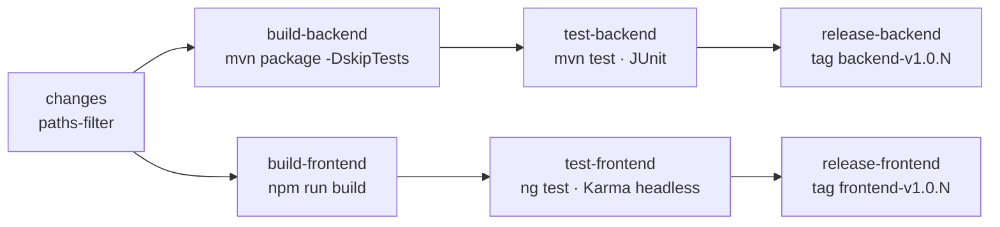

# 5. Processo di Sviluppo e Code Snippets

[⬅ Indice](./README.md) | [Avanti: Test Funzionali ➡](./6-Test_Funzionali.md)

Lo sviluppo è stato guidato da un approccio **incrementale (Agile)**: fasi brevi con un obiettivo di uscita verificabile (entità coerenti, endpoint funzionanti, build che compila, test verdi), seguite da iterazioni di rifinitura su sicurezza, esperienza d'uso e infrastruttura. Il progetto è individuale e sviluppato part-time; il calendario effettivo è ricostruito nel [capitolo 7](./7-Pianificazione_Fasi.md).

## Il flusso operativo

1. **Analisi e design.** Contesto della clinica, casi d'uso, modello ER e diagrammi UML/C4, poi verificati a posteriori contro le entità JPA effettivamente implementate.
2. **Backend prima, client dopo.** Entità, repository, DTO come record immutabili, mapper MapStruct e controller REST in Spring Boot con H2 in-memory; documentazione Swagger generata dal codice.
3. **Sicurezza.** JWT stateless, 2FA TOTP e RBAC per ruolo, raffinato più tardi con controlli di **ownership** per singola risorsa quando è emerso che un controllo per solo ruolo non impediva a un paziente di leggere i dati di un altro paziente.
4. **Frontend Angular.** SPA con componenti standalone, routing con guardie, dashboard per ruolo, interceptor HTTP per autenticazione, errori e caricamento.
5. **Iterazioni di consolidamento**, ciascuna in una pull request dedicata: RBAC completo e correzione di un accesso non autorizzato ai referti (IDOR), CRUD e validazioni; routing reale con guardie, CRUD appuntamenti ed esportazione stampabile; miglioramenti per il medico (slot in serie, terapie, storico pazienti); due passate di design system e coerenza visiva; login a schermo intero.
6. **Contenitori e CI.** Dockerfile multi-stage, Docker Compose, immagine unica e pipeline GitHub Actions con release.
7. **Verifica finale documentazione ↔ codice**, con test e screenshot rieseguiti sull'applicazione reale.

Durante l'integrazione è emerso un problema di percezione: l'interfaccia sembrava «lenta» perché ogni chiamata asincrona, anche se veloce, faceva comparire e sparire lo spinner. È stato risolto con un interceptor di caricamento con ritardo di attivazione (snippet 2).

---

## CI Pipeline e Automazione

La pipeline è definita in `.github/workflows/ci.yml` con **GitHub Actions** ed è eseguita a ogni `push` e `pull request` su `main`. Un job iniziale (`changes`, basato su `dorny/paths-filter`) rileva quali moduli contengono modifiche, così **backend e frontend procedono in modo indipendente** solo se necessario. La concorrenza è configurata in modo che una nuova esecuzione annulli quella precedente sullo stesso ref.



| Job | Cosa fa | Note |
|---|---|---|
| `build-backend` | JDK 21 (Temurin), `mvn -B clean package -DskipTests`, pubblica il jar come artifact | Cache Maven |
| `test-backend` | `mvn -B test` (JUnit + JaCoCo) | Dipende da `build-backend` |
| `release-backend` | Crea tag e GitHub Release con il jar | Solo su push a `main` |
| `build-frontend` | Node 22, `npm install`, build di produzione, pubblica `dist/` | Cache npm |
| `test-frontend` | `ng test` headless con il launcher `ChromeHeadlessCI` | Dipende da `build-frontend` |
| `release-frontend` | Comprime `dist/` e crea tag e Release | Solo su push a `main` |

Se un job fallisce, la pipeline segnala l'errore su GitHub e il job di release a valle non parte. La pipeline non include analisi statica né scansione delle vulnerabilità. **Il Continuous Deployment non è implementato** (nessuna infrastruttura di hosting dedicata per un progetto didattico): è indicato tra gli sviluppi futuri nel [capitolo 9](./9-Valutazione_Risultati.md#sviluppi-futuri).

---

## Strategia di test

| Livello | Strumenti | Cosa verifica |
|---|---|---|
| **Unitari di service, mapper e strategie** (backend) | JUnit 5, Mockito | Logica di dominio con repository simulati: percorso positivo, input non validi, regole di business (sovrapposizione slot, ownership terapia, un referto per visita…) |
| **Controller** (backend) | `@WebMvcTest` + MockMvc | Codici di stato, corpo delle risposte e validazione dei DTO. I filtri di sicurezza sono disattivati (`addFilters = false`), perciò *non* verificano le regole di autorizzazione |
| **Sicurezza end-to-end** (backend) | `@SpringBootTest` + `SecurityRbacIntegrationTest` (9 test) | Contesto Spring completo con filtro e method security attivi: accesso senza token, ruolo errato, ownership, rotte pubbliche |
| **Frontend** | Karma + Jasmine, Chrome headless | Componenti, servizi, guardie e interceptor |
| **Manuali/end-to-end** | Chiamate reali all'API e navigazione dell'applicazione | Flussi completi, RBAC e 2FA sull'app in esecuzione — riportati nel [capitolo 6](./6-Test_Funzionali.md) |

Risultati: **137 test backend** (28 controller, 8 mapper, 20 sicurezza, 67 service, 14 strategie) e **99 test frontend**, tutti superati. Le percentuali di copertura misurate, comprese quelle basse del frontend, sono nel [capitolo 6](./6-Test_Funzionali.md#1-test-automatici).

Un limite metodologico di cui tenere conto: i test dei controller non passano dalla security chain. La lacuna è compensata da `SecurityRbacIntegrationTest` (che però copre solo 9 scenari) e dalle verifiche manuali; una copertura sistematica di *tutte* le regole `@PreAuthorize` con test automatici è un'estensione naturale.

---

## Sviluppo assistito da intelligenza artificiale

**Claude** (Anthropic) è stato usato come assistente di pair-programming per velocizzare la scrittura di codice ripetitivo e a basso rischio (DTO, mapper, configurazione, parte dei test JUnit e Karma) a partire dai casi individuati dall'autore, e per la revisione incrociata di documentazione e codice. Le decisioni di architettura, i design pattern, la modellazione del dominio e le scelte di sicurezza restano dell'autore. Ogni proposta è stata riletta e compresa prima dell'integrazione; è proprio in una revisione che è emerso il problema di sicurezza descritto sotto. Diversi commit prodotti con questo supporto riportano la riga `Co-Authored-By`.

---

## Difficoltà incontrate

**1. Un'eccezione di sicurezza dimenticata dopo la rimozione di una funzionalità.** Nelle fasi iniziali `POST /api/tickets` era stato lasciato senza restrizioni per consentire a un'integrazione esterna di aprire ticket per conto del paziente, senza propagare un token utente. Quando quell'integrazione è stata rimossa per concentrare l'elaborato sul nucleo RESTful, la premessa è venuta meno ma il codice sarebbe rimasto un varco di scrittura aperto a chiunque conoscesse l'URL. È stato ripristinato un controllo esplicito con `@PreAuthorize` e ownership (snippet 5), e una ricerca sistematica di tutte le annotazioni nei controller ha confermato che era l'unico endpoint scoperto. La lezione: *un'eccezione di sicurezza introdotta per un'integrazione va rivista quando quell'integrazione cambia o sparisce*.

**2. Spinner che «sfarfalla».** Vedi snippet 2.

**3. 2FA senza sessione.** Vedi snippet 4: un compromesso consapevole e documentato.

**4. Difetti scoperti durante la verifica finale.** Rieseguendo l'applicazione per aggiornare questa documentazione sono emersi problemi che i test esistenti non rilevavano: quattro test di `LoginComponent` fallivano dopo l'ultima revisione grafica (mancava un `Router` nel test: corretto), il backend risponde `403` e mai `401` per token assenti o scaduti (quindi il logout automatico dell'interceptor non scatta), e l'anteprima PDF del referto non funziona perché richiede un header `Authorization` che un `<iframe>` non invia. Sono descritti come limiti noti nel [capitolo 9](./9-Valutazione_Risultati.md#limiti-noti).

---

## Snippets di Codice Salienti

### 1. Intercettazione degli errori HTTP (frontend)
Un passaggio importante è stata la centralizzazione della gestione degli errori, sostituendo gli `alert()` di sistema con un componente Toast per gli errori HTTP (restano cinque `alert()` di conferma in tre componenti: si veda il [capitolo 9](./9-Valutazione_Risultati.md#limiti-noti)). L'`errorInterceptor` traduce i `ProblemDetail` del backend in messaggi leggibili, esclude le chiamate che mostrano già l'errore accanto ai campi del form (login, registrazione, 2FA) tramite un `HttpContextToken`, e nei `403` ricorda con quale identità l'utente è collegato.

```typescript
// frontend/src/app/interceptors/error.interceptor.ts (estratto)
export const errorInterceptor: HttpInterceptorFn = (req, next) => {
  const authService = inject(AuthService);
  const router = inject(Router);
  const toastService = inject(ToastService);

  return next(req).pipe(
    catchError((error: HttpErrorResponse) => {
      // Login/registrazione/2FA mostrano già l'errore inline: nessun toast globale
      if (req.context.get(SILENT_ERROR)) {
        return throwError(() => error);
      }

      // Token scaduto: logout e ritorno alla pagina di accesso
      if (error.status === 401) {
        authService.logout();
        router.navigate(['/account']);
        toastService.showInfo('La tua sessione è scaduta. Effettua nuovamente il login.');
        return throwError(() => error);
      }

      let errorMessage = 'Si è verificato un errore inaspettato.';
      if (error.error?.detail) {
        errorMessage = error.error.detail;          // ProblemDetail RFC 7807 di Spring
      }
      if (error.status === 403) {
        errorMessage += ` (sei loggato come ${authService.getRoleLabel()} — ${authService.getEmail()})`;
      }
      toastService.showError(errorMessage);
      return throwError(() => error);
    })
  );
};
```

> **Attenzione:** il ramo `401` è pensato per il token scaduto, ma Spring Security risponde `403` in quel caso (si veda il [capitolo 9](./9-Valutazione_Risultati.md#limiti-noti)): oggi il logout automatico non si attiva. La correzione richiede un `AuthenticationEntryPoint` che risponda `401`.

### 2. Loading spinner con ritardo (frontend)
Se le API rispondono in meno di 300 ms lo spinner non compare mai, eliminando l'effetto «sfarfallio» tipico delle SPA. Un contatore delle richieste attive coordina più chiamate simultanee.

```typescript
// frontend/src/app/services/loading.service.ts
export class LoadingService {
  private activeRequests = 0;
  private isLoadingSubject = new BehaviorSubject<boolean>(false);
  public isLoading$ = this.isLoadingSubject.asObservable();
  private showTimer: any;

  show() {
    this.activeRequests++;
    if (this.activeRequests === 1) {
      // Aspetta 300ms: se la chiamata è più veloce, lo spinner non appare mai
      this.showTimer = setTimeout(() => this.isLoadingSubject.next(true), 300);
    }
  }

  hide() {
    this.activeRequests--;
    if (this.activeRequests <= 0) {
      this.activeRequests = 0;
      clearTimeout(this.showTimer);            // annulla lo spinner se la call è già finita
      this.isLoadingSubject.next(false);
    }
  }
}
```

### 3. Filtro JWT stateless (backend)
Tutte le richieste, tranne le rotte pubbliche, passano da un filtro che estrae il token dall'header `Authorization`, ne verifica firma e scadenza e carica nel `SecurityContext` utente e ruoli, così che `@PreAuthorize` possa valutare le espressioni.

```java
// backend/.../security/JwtAuthenticationFilter.java (estratto)
@Override
protected void doFilterInternal(HttpServletRequest request, HttpServletResponse response,
                                FilterChain filterChain) throws ServletException, IOException {
    try {
        String jwt = parseJwt(request);                       // header "Bearer <token>"
        if (jwt != null && jwtUtils.validateJwtToken(jwt)) {
            String username = jwtUtils.getUserNameFromJwtToken(jwt);
            UserDetails userDetails = userDetailsService.loadUserByUsername(username);
            var authentication = new UsernamePasswordAuthenticationToken(
                    userDetails, null, userDetails.getAuthorities());
            authentication.setDetails(new WebAuthenticationDetailsSource().buildDetails(request));
            SecurityContextHolder.getContext().setAuthentication(authentication);
        }
    } catch (Exception e) {
        logger.error("Cannot set user authentication: {}", e.getMessage());
    }
    filterChain.doFilter(request, response);   // se il token manca o non è valido: richiesta anonima
}
```

### 4. Autenticazione a due fattori in un sistema stateless
Senza sessione lato server bisogna collegare i due passaggi in un altro modo. La soluzione adottata usa due endpoint: il primo verifica email e password e, se la 2FA è attiva, risponde `requires2fa = true` **senza token**; il secondo riceve email e codice TOTP e solo allora emette il JWT.

```java
// backend/.../service/AuthService.java (estratto)
public LoginResponse authenticateUser(LoginRequest loginRequest) {
    Authentication authentication = authenticationManager.authenticate(
        new UsernamePasswordAuthenticationToken(loginRequest.email(), loginRequest.password()));
    AppUser user = userRepository.findByEmail(loginRequest.email())
            .orElseThrow(() -> new RuntimeException("Utente non trovato"));
    if (user.is2faEnabled()) {
        return LoginResponse.builder().requires2fa(true).build();   // nessun token
    }
    return generateTokenResponse(authentication, user);
}

public LoginResponse verify2faAndLogin(TwoFactorLoginRequest request) {   // email + codice, NON la password
    AppUser user = userRepository.findByEmail(request.email())
            .orElseThrow(() -> new RuntimeException("Utente non trovato"));
    if (!codeVerifier.isValidCode(user.getSecretKey(), request.code())) {
        throw new RuntimeException("Codice 2FA non valido");
    }
    // … costruisce l'Authentication e genera il token (generateTokenResponse)
}
```

**Il compromesso.** Il secondo endpoint non richiede la password: chi conoscesse già il codice TOTP di un utente (ad esempio perché ha compromesso il dispositivo di autenticazione, ma non la password) potrebbe autenticarsi chiamandolo direttamente, saltando il primo passaggio. La soluzione corretta è far restituire al primo endpoint un *pre-authentication token* a validità brevissima e senza privilegi, da presentare obbligatoriamente al secondo insieme al codice, legando i due passaggi. Per limiti di tempo non è stata implementata: è dichiarata come limite noto.

### 5. Controllo degli accessi a grana fine (ownership)
Un controllo per solo ruolo non basta a impedire che un paziente acceda ai dati di un altro paziente: hanno lo stesso ruolo, ma solo uno è titolare della risorsa. Le regole sono centralizzate in un unico bean richiamato dalle espressioni SpEL di `@PreAuthorize`.

```java
// backend/.../security/OwnershipService.java (estratto)
@Component("ownership")
@RequiredArgsConstructor
public class OwnershipService {
    private final PatientRepository patientRepository;
    // … DoctorRepository, AppointmentRepository, MedicalReportRepository, SlotRepository

    public boolean isSelfPatient(Long patientId, Authentication authentication) {
        if (authentication == null || patientId == null) return false;
        return patientRepository.findByEmail(authentication.getName())
                .map(patient -> patientId.equals(patient.getId()))
                .orElse(false);
    }
    // … isSelfDoctor, canManageAppointmentStatus, canAccessReport, canDownloadReport …
}
```

```java
// backend/.../controller/TicketController.java — un paziente può aprire ticket solo per sé
@PostMapping
@PreAuthorize("hasRole('PATIENT') and @ownership.isSelfPatient(#ticketDTO.patientId(), authentication)")
public ResponseEntity<TicketDTO> createTicket(@Valid @RequestBody TicketDTO ticketDTO) {
    return new ResponseEntity<>(ticketService.createTicket(ticketDTO), HttpStatus.CREATED);
}
```

La stessa regola è riutilizzata su appuntamenti, referti, terapie, slot e ticket: dichiarata una volta per caso d'uso, invece di essere reimplementata endpoint per endpoint con il rischio di incongruenze.

### 6. Strategy pattern per le transizioni di stato (backend)
Ogni stato ha una propria strategia; la Factory riceve da Spring la lista di tutti i bean che implementano l'interfaccia e li indicizza per stato, senza registrazione manuale.

```java
// backend/.../service/strategy/appointment/AppointmentStrategyFactory.java
@Component
public class AppointmentStrategyFactory {
    private final Map<AppointmentStatus, AppointmentStatusStrategy> strategies;

    public AppointmentStrategyFactory(List<AppointmentStatusStrategy> strategyList) {
        this.strategies = strategyList.stream()
                .collect(Collectors.toMap(AppointmentStatusStrategy::getSupportedStatus, Function.identity()));
    }

    public AppointmentStatusStrategy getStrategy(AppointmentStatus status) {
        return strategies.get(status);
    }
}
```

### 7. Slot in serie senza sovrapposizioni (backend)
La parte delicata è verificare la sovrapposizione non solo contro gli slot già nel database (`existing`) ma anche contro quelli che il ciclo sta generando (`toCreate`): senza il secondo controllo due slot della stessa richiesta potrebbero sovrapporsi. Gli intervalli esclusi vengono restituiti in `skipped`.

```java
// backend/.../service/SlotService.java — createSlotsBatch (estratto)
LocalTime cursor = request.startTime();
while (!cursor.plusMinutes(request.slotDurationMinutes()).isAfter(request.endTime())) {
    LocalTime slotEnd = cursor.plusMinutes(request.slotDurationMinutes());
    LocalTime slotStart = cursor;
    boolean conflicts = existing.stream().anyMatch(s -> overlaps(s.getStartTime(), s.getEndTime(), slotStart, slotEnd))
            || toCreate.stream().anyMatch(s -> overlaps(s.getStartTime(), s.getEndTime(), slotStart, slotEnd));
    if (!conflicts) {
        toCreate.add(Slot.builder().doctor(doctor).date(request.date())
                .startTime(slotStart).endTime(slotEnd).build());
    } else {
        skipped.add(SkippedSlotRange.builder().startTime(slotStart).endTime(slotEnd).build());
    }
    cursor = slotEnd;
}
```

### 8. Disponibilità calcolata, non persistita (backend)

```java
// backend/.../service/SlotService.java
private boolean isBooked(Slot slot, List<Appointment> doctorAppointments) {
    return doctorAppointments.stream().anyMatch(a ->
            a.getStatus() != AppointmentStatus.CANCELLED
                    && a.getAppointmentDate().toLocalDate().equals(slot.getDate())
                    && !a.getAppointmentDate().toLocalTime().isBefore(slot.getStartTime())
                    && a.getAppointmentDate().toLocalTime().isBefore(slot.getEndTime()));
}
```

Questo calcolo serve a mostrare lo slot come occupato in interfaccia e a impedirne l'eliminazione; **non** viene applicato alla creazione di un appuntamento, che quindi non previene la doppia prenotazione dello stesso orario (limite noto, [capitolo 9](./9-Valutazione_Risultati.md#limiti-noti)).

### 9. Composizione di mapper MapStruct (backend)

```java
// backend/.../mapper/AppointmentMapper.java
@Mapper(componentModel = "spring", uses = {PatientMapper.class, DoctorMapper.class})
public interface AppointmentMapper {
    @Mapping(source = "patient.id", target = "patientId")
    @Mapping(source = "doctor.id", target = "doctorId")
    AppointmentDTO toDto(Appointment appointment);

    @Mapping(source = "patientId", target = "patient.id")
    @Mapping(source = "doctorId", target = "doctor.id")
    Appointment toEntity(AppointmentDTO appointmentDto);
}
```

`uses = {...}` riutilizza i mapper dei modelli annidati, così lo stesso DTO espone sia gli ID piatti (utili in scrittura) sia gli oggetti `patient`/`doctor` completi (utili in lettura, senza una seconda chiamata).

[Avanti: Test Funzionali ➡](./6-Test_Funzionali.md)
