# 6. Test Funzionali dell'Applicazione

[⬅ Indice](./README.md) | [Avanti: Pianificazione delle Fasi ➡](./7-Pianificazione_Fasi.md)

Questo capitolo documenta il funzionamento dell'applicazione su tre piani: i **test automatici** (§1), gli **screenshot** dell'applicazione reale (§2) e le **verifiche end-to-end sull'API** (§3), con l'elenco dei difetti emersi (§4).

**Come sono state ottenute le evidenze (20 settembre 2026).** Backend (`java -jar`, JDK 21) e frontend (`ng serve`) sono stati avviati in locale, il database ripopolato con dati di prova creati **attraverso le API reali** (slot, prenotazioni, referto PDF, terapia, ticket) e gli screenshot acquisiti con Chrome headless a 1440×900. Nessuna schermata è disegnata o simulata. I test automatici sono stati eseguiti con `mvn test` e `ng test`.

## 1. Test automatici

| Suite | Test | Esito | Strumenti |
|---|---|---|---|
| Backend | **137** in 34 classi | ✅ tutti superati | JUnit 5, Mockito, Spring Test, MockMvc |
| Frontend | **99** in 22 file di spec | ✅ tutti superati | Karma, Jasmine, Chrome headless |

Ripartizione dei test backend: service 67, controller 28, sicurezza 20 (di cui 9 di integrazione RBAC con security chain reale), strategie di stato 14, mapper 8.

### Copertura misurata

| | Righe | Istruzioni | Rami | Metodi | Classi |
|---|---|---|---|---|---|
| **Backend** (JaCoCo) | **82,3 %** (890/1081) | 59,3 % | 16,0 % | 71,6 % | 91,9 % |
| **Frontend** (Karma/Istanbul) | **38,6 %** (371/961) | 38,8 % (406/1046) | 22,3 % (55/247) | 28,3 % (97/343) | — |

Come leggere questi numeri, senza abbellirli:

- Il backend ha una buona copertura di **righe**, ma quella dei **rami** è bassa: molte condizioni (ad esempio i diversi esiti di `OwnershipService`) non sono esercitate da entrambi i lati. La differenza tra righe e istruzioni dipende in parte dal codice generato da Lombok e MapStruct, che JaCoCo conta.
- Il frontend è coperto soprattutto nei **servizi, guardie e interceptor**; i componenti di presentazione (dashboard, form di prenotazione, pagine) hanno pochi test. La copertura complessiva è quindi contenuta.
- I test dei controller non verificano le regole `@PreAuthorize` (filtri disattivati): per questo sono state eseguite le verifiche del §3 sull'applicazione reale.

> **Correzione emersa durante la verifica.** Alla prima esecuzione, 4 test frontend su 99 fallivano (`LoginComponent`: `No provider for ActivatedRoute`), perché l'ultima revisione grafica aveva aggiunto un `routerLink` al login senza aggiornare il relativo spec. La correzione è di una riga (`provideRouter([])` nel `TestBed` di `login.component.spec.ts`); dopo di essa la suite è 99/99. Senza questa correzione la pipeline CI del frontend sarebbe fallita al prossimo push.

## 2. Screenshot dell'applicazione

Tutte le immagini sono in [`doc/img/`](./img). Gli utenti sono quelli di prova descritti nel [README](./README.md#avvio-rapido).

### 2.1 Accesso e registrazione

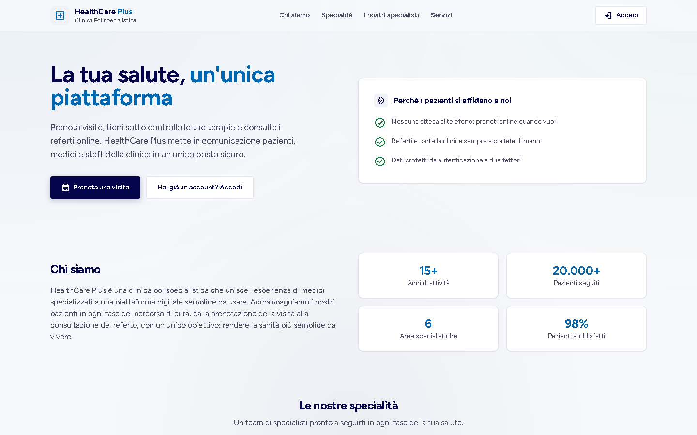
*Landing page pubblica (visibile solo agli ospiti; chi è già autenticato viene reindirizzato alla dashboard). Le cifre della sezione «Chi siamo» (anni di attività, pazienti seguiti, soddisfazione) sono testo illustrativo, non dati reali.*

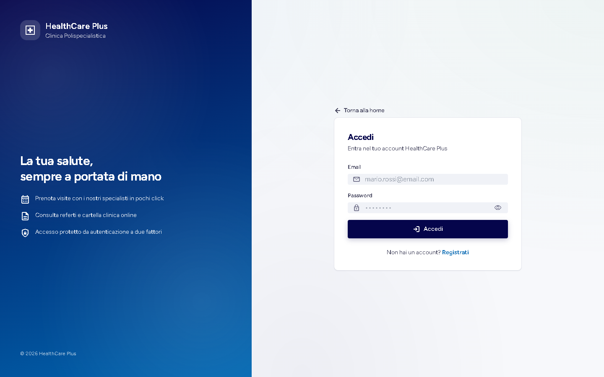
*Schermata di accesso a tutto schermo, con pannello di presentazione a sinistra.*

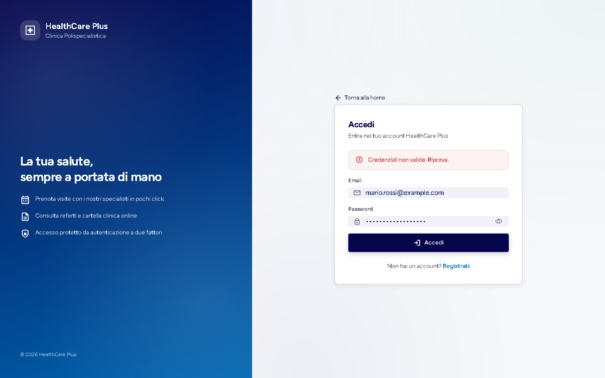
*Credenziali errate: il messaggio compare accanto ai campi del form. Le chiamate di login sono escluse dal Toast globale tramite `SILENT_ERROR`.*

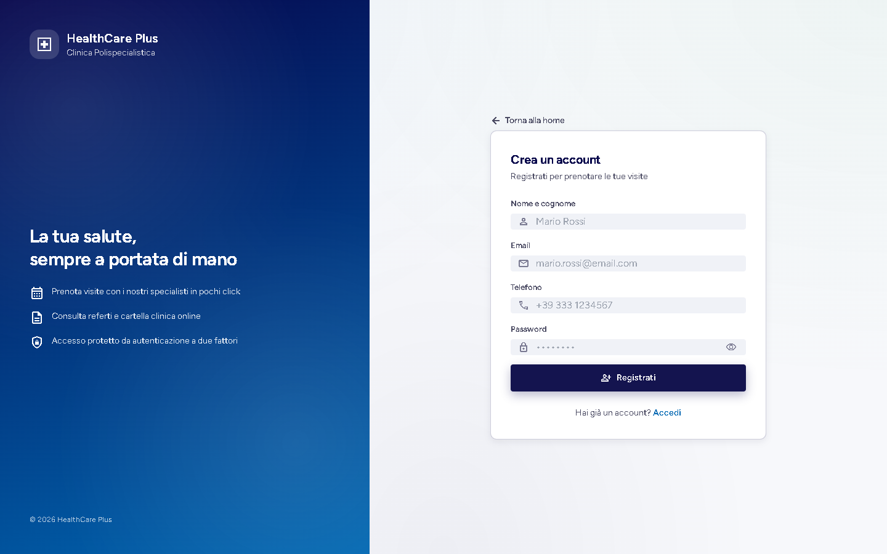
*Registrazione di un nuovo paziente (nome, email, telefono, password). Chi si registra ottiene sempre il ruolo `PATIENT`.*

### 2.2 Vista Paziente

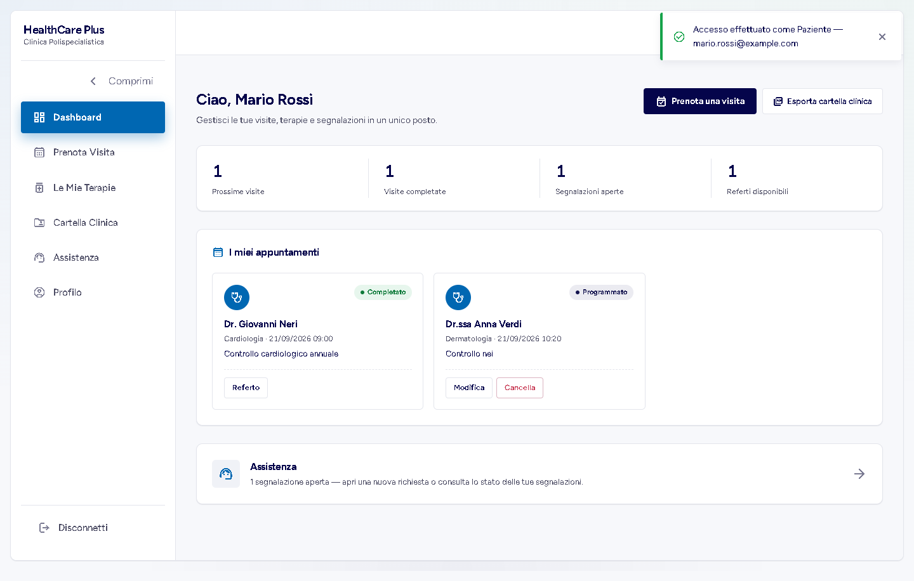
*Dashboard: contatori (prossime visite, completate, segnalazioni aperte, referti), elenco degli appuntamenti con azioni «Modifica», «Cancella» e «Referto», pulsanti «Prenota una visita» ed «Esporta cartella clinica». Il Toast in alto conferma l'accesso con ruolo ed email.*

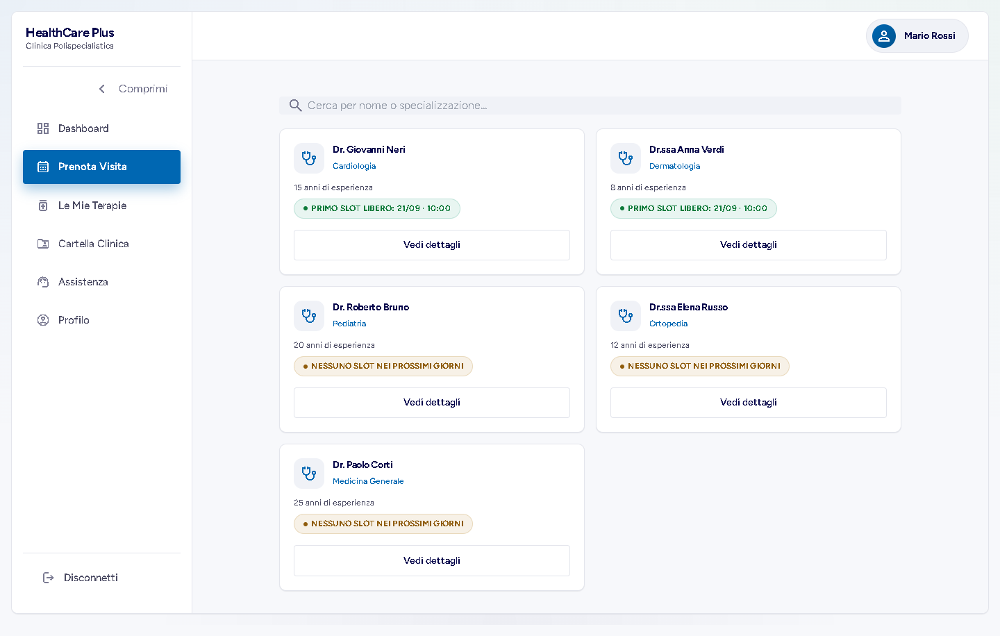
*Elenco dei medici con ricerca per nome o specializzazione e «primo slot libero» calcolato dal backend in una sola chiamata (`GET /api/slots/next-available`). I medici senza slot mostrano «nessuno slot nei prossimi giorni».*

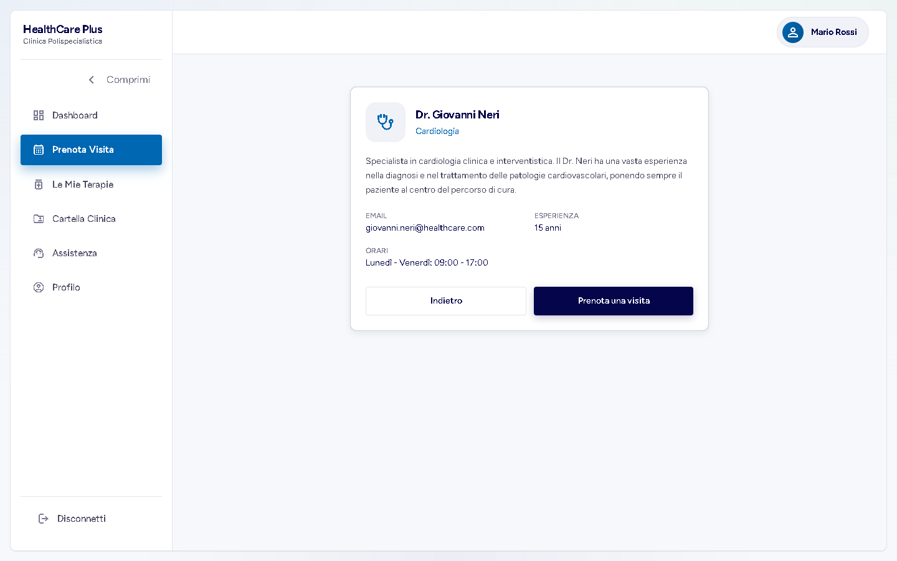
*Scheda del medico: presentazione, email, anni di esperienza e orari di lavoro.*

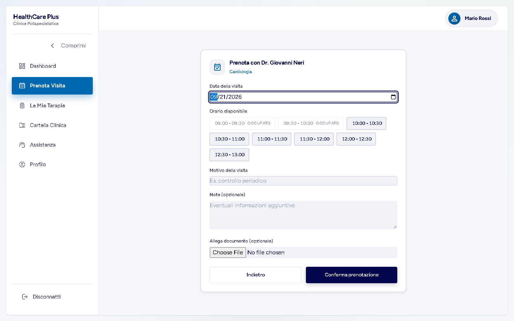
*Form di prenotazione: scelta della data e degli slot dichiarati dal medico. Le fasce 09:00 e 09:30 risultano **occupate** e non selezionabili perché già prenotate; è possibile allegare un documento facoltativo.*

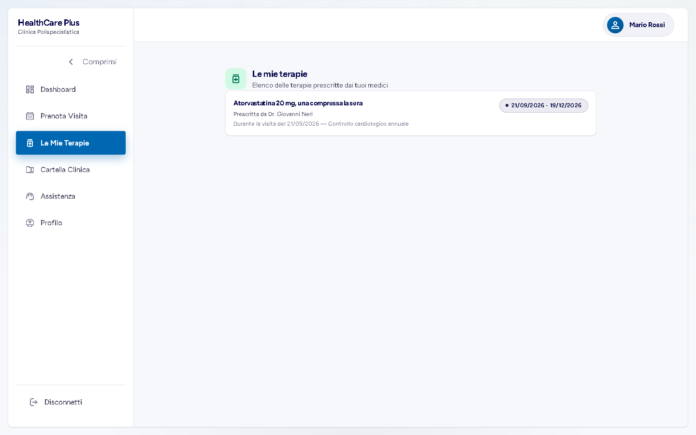
*Terapia prescritta dal medico, con periodo di validità e riferimento alla visita da cui è nata.*

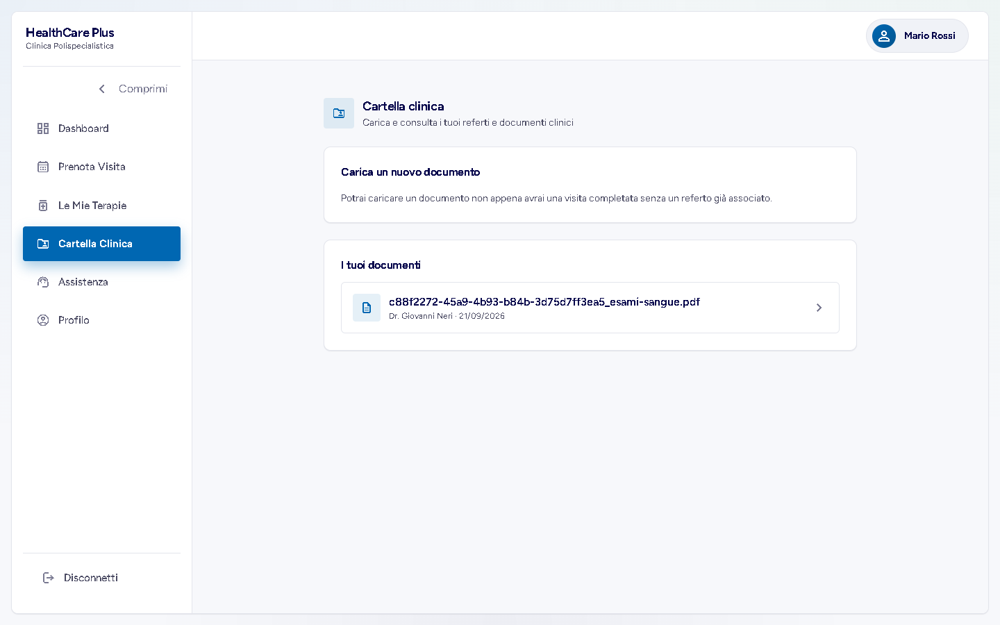
*Cartella clinica: elenco dei documenti caricati, con medico e data della visita. L'interfaccia abilita il caricamento di un nuovo documento solo per visite completate prive di referto.*

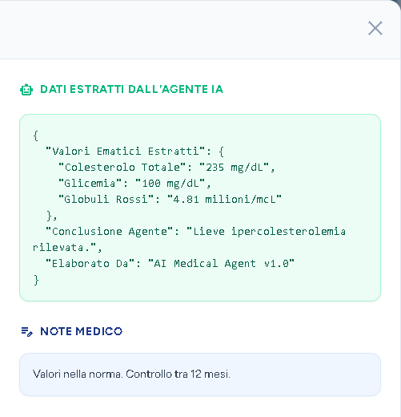
*Referto di una visita completata: dati estratti dall'agente (**simulati**, si veda il [capitolo 9](./9-Valutazione_Risultati.md)) e note conclusive del medico. Nella schermata reale a sinistra compare anche l'anteprima del PDF, che non è funzionante (limite noto, §4): qui è stato mostrato solo il pannello dei dati.*

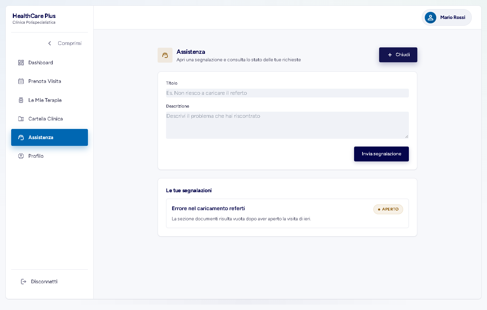
*Area «Assistenza»: form «Nuova segnalazione» e ticket già aperti dal paziente, con il relativo stato.*

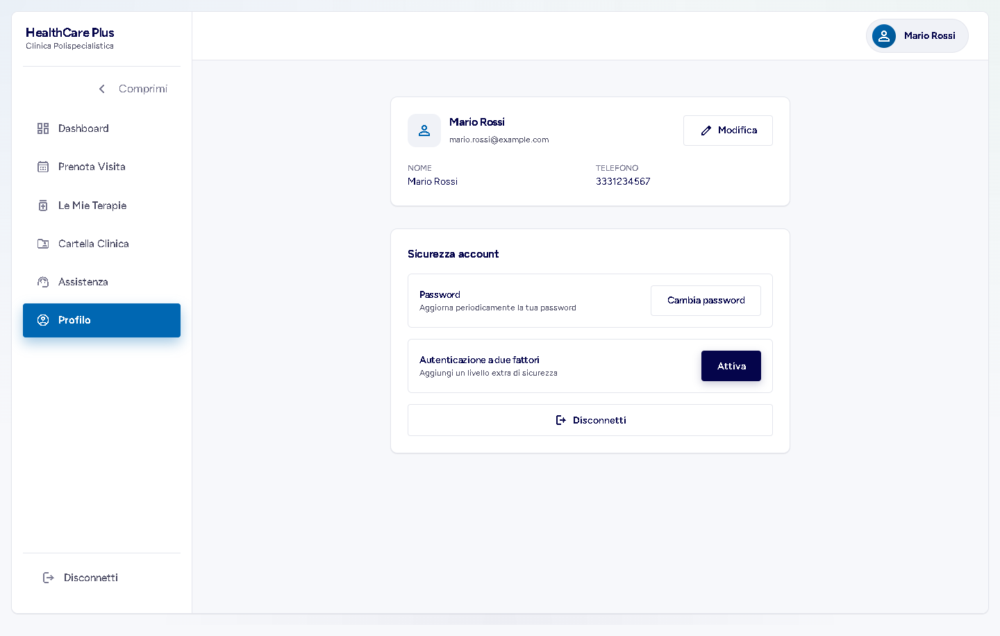
*Profilo e sicurezza dell'account: dati anagrafici modificabili, cambio password e attivazione dell'autenticazione a due fattori.*

### 2.3 Vista Medico

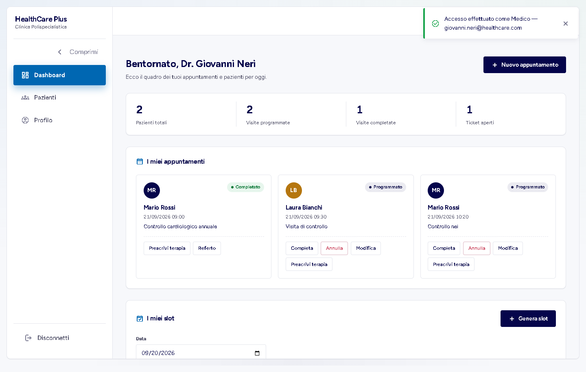
*Dashboard del medico: contatori, appuntamenti a lui assegnati (visita completata e due programmate, di cui una di un altro paziente) con azioni «Completa», «Annulla», «Modifica», «Prescrivi terapia» e «Referto», e sotto la sezione «I miei slot» con il pulsante «Genera slot». Il medico vede solo i propri appuntamenti.*

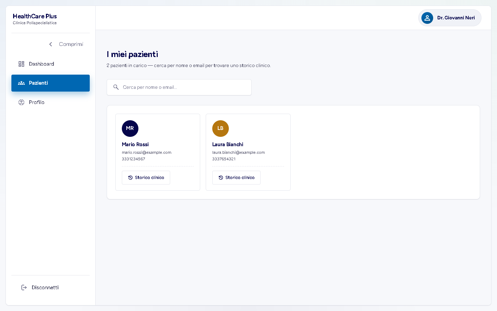
*Elenco dei pazienti in carico al medico, con ricerca per nome o email.*

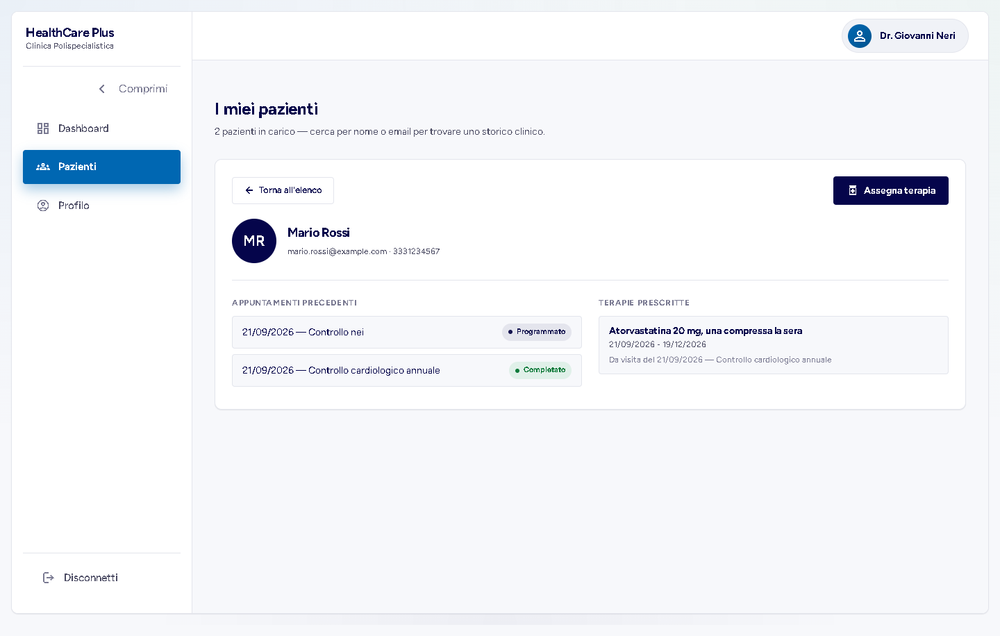
*Storico clinico: appuntamenti precedenti e terapie prescritte, con il pulsante «Assegna terapia».*

### 2.4 Vista Supporto

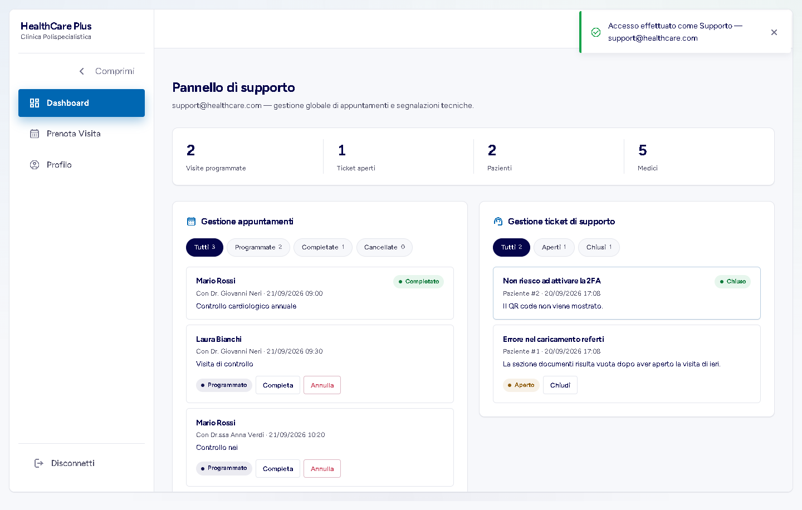
*Pannello di supporto: statistiche globali (`GET /api/dashboard/stats`), gestione di tutti gli appuntamenti e dei ticket con filtri per stato. Il ticket «Non riesco ad attivare la 2FA» risulta chiuso, l'altro è ancora aperto.*

### 2.5 API (Swagger UI)

Gli screenshot di Swagger UI sono nel [capitolo 3](./3-API_Swagger.md). Poiché il documento OpenAPI non dichiara uno schema di sicurezza, dalla UI si possono provare solo gli endpoint pubblici: gli endpoint protetti sono stati verificati con chiamate HTTP dirette (§3).

## 3. Verifiche end-to-end sull'API

Le chiamate sono state eseguite da uno script contro il backend reale, con utenti di ruoli diversi. Il codice TOTP della 2FA è stato calcolato dallo script secondo RFC 6238, quindi la verifica dei due passaggi è realmente esercitata. **45 verifiche: 44 con l'esito previsto e 1 con un codice di stato diverso da quello atteso** (la creazione di una terapia risponde `200` e non `201`: è il comportamento del codice, riportato in tabella).

### 3.1 Flusso principale

| Verifica | Esito reale |
|---|---|
| Il medico genera 6 slot da 30 min (09:00–12:00) con `POST /slots/batch` | `201` |
| Nuovo batch 11:00–13:00 sovrapposto ai precedenti | `201`: **2 slot creati** (12:00, 12:30) e **2 saltati** (11:00, 11:30 → `skipped`) |
| Il paziente prenota una visita per sé | `201` |
| Prenotazioni aggiuntive (altro medico, altro paziente) | `201` |
| Il paziente carica un referto PDF | `200`, con `extractedData` popolato |
| Caricamento di un file di testo come referto | `400` «Sono ammessi solo referti in formato PDF» |
| Il medico aggiunge le note al referto | `200`; la visita passa a `COMPLETED` |
| Il paziente legge il referto della propria visita | `200` |
| Il medico prescrive una terapia collegata alla visita | `200` *(atteso 201)* |
| Terapia collegata alla visita di un altro paziente | `400` «L'appuntamento indicato non appartiene a questo paziente e medico» |
| Terapia con data di fine precedente all'inizio | `400` |
| Il paziente apre un ticket; un secondo paziente ne apre un altro | `201` ×2 |
| Il supporto chiude un ticket | `200` |

### 3.2 Autorizzazione e ownership (RBAC)

| Verifica | Esito reale |
|---|---|
| `GET /appointments` **senza token** | `403` |
| Laura legge le visite di Mario (`GET /appointments/patient/1`) | `403` |
| Laura apre un ticket a nome di Mario | `403` |
| Laura scarica il referto di Mario | `403` |
| Mario scarica il proprio referto | `200` |
| Il medico dell'appuntamento scarica il referto | `200` |
| **Un altro medico** scarica il referto | `403` |
| Un paziente prova a impostare una visita come `COMPLETED` | `403` |
| Un paziente cancella la **propria** visita | `200` |
| Un paziente cancella la visita di un altro | `403` |
| Un paziente elenca tutti i ticket / tutti i pazienti / le statistiche | `403` ×3 |
| Il supporto elenca i ticket / legge le statistiche | `200` ×2 |
| Un paziente crea uno slot | `403` |
| La dott.ssa Verdi crea uno slot a nome del dott. Neri | `403` |
| Il medico elimina uno slot già prenotato | `400` «Non puoi eliminare uno slot già prenotato» |
| Registrazione con un'email già in uso | `400` |
| Login con password errata | `400` |

### 3.3 Autenticazione a due fattori

| Passo | Esito reale |
|---|---|
| Registrazione di un nuovo paziente e primo login (senza 2FA) | `201`, `200` con token |
| `GET /auth/2fa/setup` | `200`, segreto e QR code |
| `POST /auth/2fa/enable` con un codice TOTP valido | `200` |
| Nuovo login, passo 1 | `200` con `requires2fa: true` e **nessun token** |
| Passo 2 con codice errato (`000000`) | `400` «Codice 2FA non valido» |
| Passo 2 con codice corretto | `200` con token JWT |
| Cambio password | `200` |

### 3.4 Comportamenti osservati che vale la pena segnalare

- **Token assente o non valido → `403`, mai `401`** (verificato anche con un token malformato e con uno scaduto).
- **Doppia prenotazione:** una seconda `POST /appointments` per lo stesso medico e lo stesso orario, già occupato, risponde `201`: il controllo di disponibilità esiste solo in lettura (flag `booked`), non in scrittura.
- **`GET /slots/doctor/{id}` senza token** risponde `403`: gli slot sono visibili a qualunque utente *autenticato*, non al pubblico.

## 4. Difetti emersi dalla verifica

Rieseguendo l'applicazione per redigere questo capitolo sono emersi i seguenti problemi. Sono elencati per trasparenza; quelli non ancora risolti sono ripresi con la loro gravità nel [capitolo 9](./9-Valutazione_Risultati.md#limiti-noti).

| # | Difetto | Stato |
|---|---|---|
| 1 | 4 test `LoginComponent` fallivano (`ActivatedRoute` mancante nel `TestBed`) | **Corretto** (`provideRouter([])` in `login.component.spec.ts`), suite 99/99 |
| 2 | Token assente/scaduto restituisce `403` invece di `401`: il ramo di logout automatico dell'interceptor Angular non scatta | Aperto |
| 3 | L'anteprima PDF e il link «Scarica» del referto usano l'URL diretto senza header `Authorization`: il PDF non è visualizzabile dall'interfaccia | Aperto |
| 4 | La creazione di un appuntamento non impedisce la doppia prenotazione dello stesso orario | Aperto |
| 5 | Il frontend si aspetta `validationErrors` come array, il backend lo restituisce come mappa campo → messaggio: i dettagli di validazione non compaiono nel Toast | Aperto (minore) |

[Avanti: Pianificazione delle Fasi ➡](./7-Pianificazione_Fasi.md)
