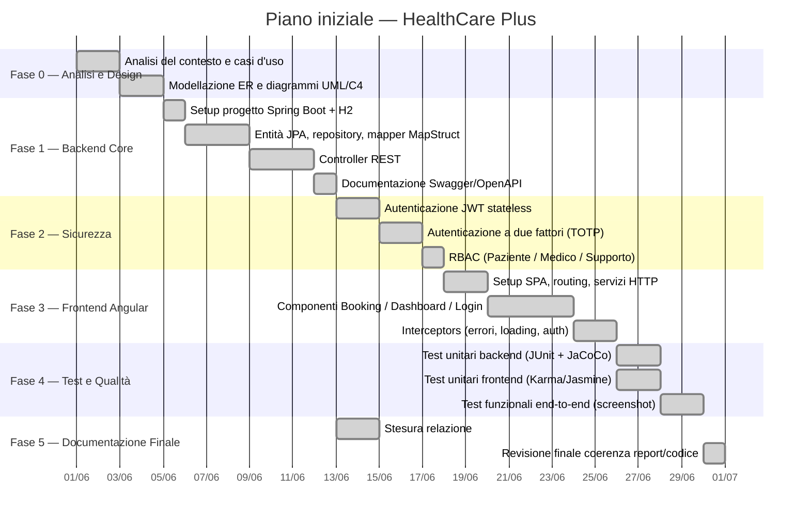
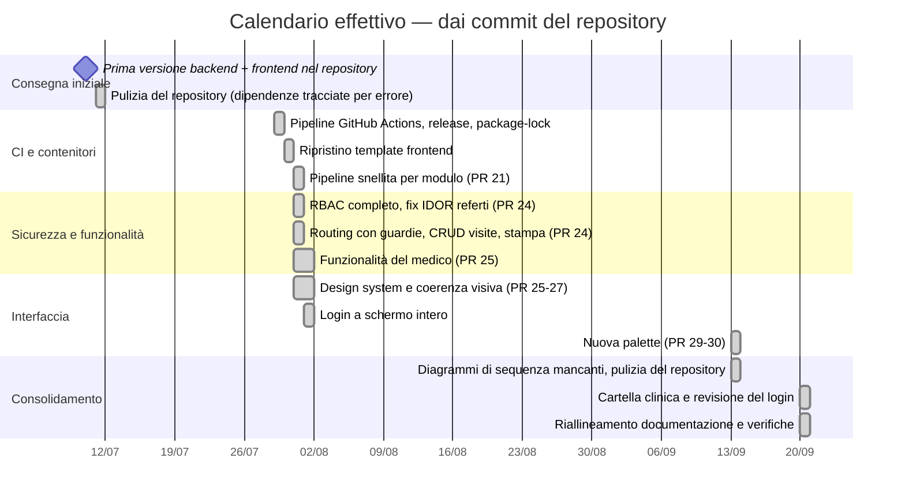

# 7. Pianificazione delle Fasi

[⬅ Indice](./README.md) | [Avanti: Risorse Utilizzate ➡](./8-Risorse_Utilizzate.md)

Il progetto è stato pianificato con un approccio incrementale a **6 fasi**, ciascuna con un obiettivo di uscita verificabile prima di passare alla successiva. Questo capitolo confronta il **piano iniziale** (§7.1–7.2) con il **calendario effettivo** ricostruito dalla storia Git (§7.3), poi riporta le dipendenze critiche e i rischi (§7.4–7.5).

Il criterio di allocazione del tempo ha seguito la complessità tecnica di ciascun modulo: la sicurezza (JWT + 2FA) è la fase a cui è stato dedicato più tempo relativo, poiché coinvolge una libreria esterna (TOTP) con maggiore incertezza implementativa.

## 7.1 Obiettivi specifici per fase

| Fase | Obiettivo specifico | Criterio di verifica | Esito |
|---|---|---|---|
| 0 — Analisi e Design | Modellare le entità del dominio sanitario (pazienti, medici, appuntamenti, referti, terapie, ticket, slot) e le loro relazioni | Diagramma ER coerente con le entità JPA implementate in Fase 1 | ✅ ER allineato alle 8 entità del codice ([cap. 2](./2-Design_Architetturale.md)) |
| 1 — Backend Core | Esporre un'API RESTful completa, documentata automaticamente | Swagger UI raggiungibile su `/swagger-ui.html` con tutti gli endpoint | ✅ 9 controller, 40 operazioni ([cap. 3](./3-API_Swagger.md)) |
| 2 — Sicurezza | Ogni endpoint sensibile richiede JWT valido e rispetta ruolo **e ownership** | Test e verifiche che mostrano `403` per token assente/non autorizzato | ✅ 9 test di integrazione RBAC + 45 verifiche end-to-end ([cap. 6](./6-Test_Funzionali.md)) |
| 3 — Frontend | Interfaccia funzionale per prenotare, consultare la dashboard e gestire il profilo, senza competenze tecniche | Flusso di prenotazione completabile dall'apertura del form alla conferma | ✅ Flusso documentato con screenshot reali |
| 4 — Test e Qualità | Copertura di test misurabile su backend e frontend | Report JaCoCo generato; suite Karma/Jasmine verde | ✅ 137 e 99 test superati; copertura righe 82,3 % e 38,6 % |
| 5 — Documentazione | Relazione tracciabile 1:1 rispetto al codice, senza funzionalità dichiarate ma non implementate | Ogni sezione verificata contro il codice sorgente | ✅ Riallineata il 20 settembre; difetti residui dichiarati nel [cap. 9](./9-Valutazione_Risultati.md) |

Gli obiettivi discendono dalla traccia del PW16 (servizio significativo per un'organizzazione sanitaria, architettura API-based, backend RESTful, interfaccia intuitiva) e sono stati resi più specifici e misurabili rispetto alla formulazione generica della traccia.

## 7.2 Piano iniziale (diagramma di Gantt)

Il piano, redatto prima dell'implementazione, prevedeva circa **33 giorni-persona** per un progetto individuale part-time.

| # | Fase | Durata stimata | Output atteso | Stato |
|---|---|---|---|---|
| 0 | Analisi del contesto e design (ER, UML, C4) | 4 giorni | Diagrammi approvati, casi d'uso definiti | ✅ Completato |
| 1 | Backend core (Spring Boot, JPA, mapper, controller REST) | 8 giorni | API su porta 8080, Swagger pubblicato | ✅ Completato |
| 2 | Sicurezza (JWT, 2FA TOTP, RBAC) | 5 giorni | Login/registrazione protetti, ruoli applicati | ✅ Completato |
| 3 | Frontend Angular (SPA, componenti, interceptors) | 8 giorni | UI navigabile su porta 4200, errori centralizzati | ✅ Completato |
| 4 | Test e qualità (JUnit, Karma/Jasmine, JaCoCo, screenshot) | 5 giorni | Suite verdi, evidenze visive | ✅ Completato (screenshot acquisiti il 20 settembre) |
| 5 | Documentazione finale e revisione di coerenza | 3 giorni | Relazione allineata al codice | ✅ Completato |

La stima è un dato di **pianificazione**: lo storico Git registra quando il codice è stato consegnato, non quante ore sono state dedicate, quindi il tempo effettivo non è misurabile a posteriori.

### Giorni per fase e tempo disponibile

Le durate del piano iniziale restano quelle indicate (circa **33 giorni-persona**). Rispetto al piano, i test funzionali e le correzioni incrementali sono diventati una fase a sé (**Fase 5**): la Fase 4 del piano (5 giorni, che comprendeva anche gli screenshot funzionali) è stata divisa in **Fase 4 – Test e qualità (3 giorni)** e **Fase 5 – Test funzionali e bug fix incrementali (2 giorni)**, e la documentazione è la **Fase 6**. Il totale non cambia.

Il progetto è individuale e part-time, con circa **un'ora la sera** e **alcune ore** nei giorni di weekend: per questo un «giorno» equivale a circa **4–5 ore** (una sessione di weekend o quattro-cinque serate), non a una giornata intera da otto ore. Dal 1 luglio al 20 settembre 2026 (82 giorni: 58 feriali e 24 di weekend) il tempo disponibile è di circa **154 ore** (1 ora per sera, 4 ore per giorno di weekend), cioè circa 4,7 ore per ciascuno dei 33 giorni. Sono **stime sul tempo disponibile**, non misure.

| Fase | Giorni | Ore equivalenti (≈ 4,7 h/giorno) |
|---|---|---|
| 0 — Analisi e design | 4 | 19 |
| 1 — Backend core | 8 | 37 |
| 2 — Sicurezza | 5 | 23 |
| 3 — Frontend Angular | 8 | 37 |
| 4 — Test e qualità | 3 | 14 |
| 5 — Test funzionali e bug fix incrementali | 2 | 9 |
| 6 — Documentazione finale | 3 | 14 |
| **Totale** | **33** | **≈ 154** |

## 7.3 Calendario effettivo (dalla storia Git)

Il repository contiene **39 commit** tra il 10 luglio e il 20 settembre 2026. Il piano iniziale è stato seguito nella sostanza, ma il lavoro reale si è articolato in iterazioni successive alla prima consegna, molte delle quali guidate da ciò che la verifica faceva emergere (in particolare sicurezza e coerenza documentazione ↔ codice).

### Iterazioni integrate tramite pull request

| Data | PR | Contenuto |
|---|---|---|
| 31 lug | #21 `ci/streamline-workflows` | Pipeline a build/test/release per modulo modificato |
| 31 lug | #23 `fix/frontend-css-cleanup` | Ripristino CSS e correzione di `karma.conf.js` e degli spec |
| 31 lug | #24 `feature/security-and-functional-fixes` | RBAC completo, correzione IDOR sui referti, CRUD e validazioni, routing con guardie, esportazione stampabile, statistiche estese |
| 1 ago | #25 `feature/oauth-doctor-ui-polish` | Nuove funzionalità per il medico, refresh del design system |
| 1 ago | #26 `feature/security-and-functional-fixes` | Seconda integrazione del branch `security-and-functional-fixes` |
| 1 ago | #27 `ui/consistency-pass` | Coerenza visiva (icone, stati vuoti, login) |
| 13 set | #29, #30 `ui/direction-b-palette` | Nuova palette e revisione grafica |

Il commit `bd5459a9` del 20 settembre aggiunge il documento di consegna in formato Word (`HealthCarePlus_ProjectWork_L31.docx`).

## 7.4 Dipendenze critiche

- La **Fase 2 (Sicurezza)** blocca la **Fase 3 (Frontend)**: i componenti Angular dipendono da login e JWT per l'instradamento autenticato.
- La **Fase 4** dipende trasversalmente da tutte le precedenti: i test funzionali richiedono l'intero stack (backend + frontend) in esecuzione insieme.
- La **Fase 5** dipende da tutte: la documentazione va riverificata a ogni modifica sostanziale del codice (lo mostra l'evoluzione del codice dalla prima consegna alle iterazioni successive, che ha reso obsoleti diversi paragrafi).

## 7.5 Rischi incontrati

| Rischio | Cosa è successo | Risposta |
|---|---|---|
| Eccezione di sicurezza lasciata dopo la rimozione di un modulo | `POST /api/tickets` era rimasto aperto | Ownership ripristinata e ricerca sistematica di tutti i `@PreAuthorize` |
| Repository appesantito da file non sorgente | Migliaia di file di dipendenze e ambienti locali tracciati per errore in più occasioni | Rimozione dal tracking e regole `.gitignore` |
| Documentazione che diverge dal codice | Strumenti, Docker e ruoli descritti in modo non più corretto | Riallineamento sistematico con verifica sull'applicazione in esecuzione (questo aggiornamento) |
| Regressione non intercettata dai test | 4 spec frontend rotti da una modifica grafica | Test rieseguiti e corretti; controllo della CI prima del merge come regola da rispettare |

[Avanti: Risorse Utilizzate ➡](./8-Risorse_Utilizzate.md)
