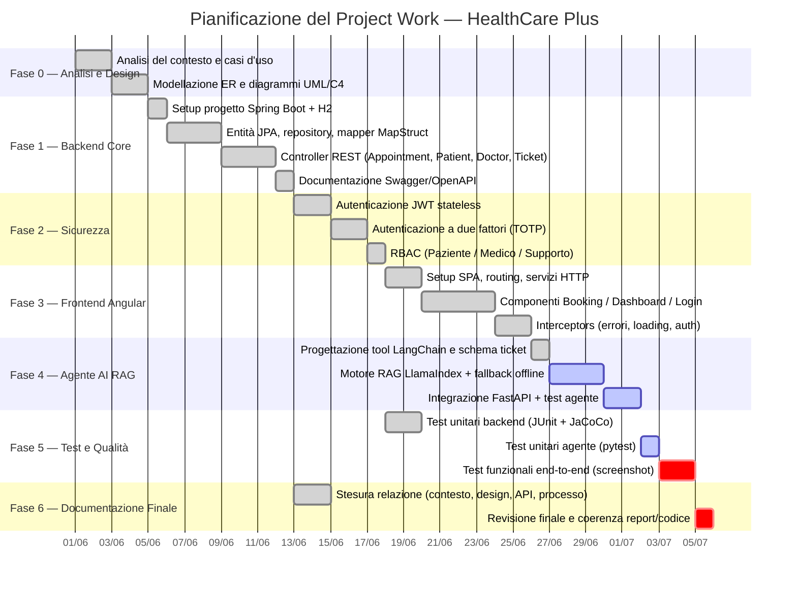

# 7. Pianificazione delle Fasi

[⬅ Indice](./README.md) | [Avanti: Risorse Utilizzate ➡](./8-Risorse_Utilizzate.md)

Il progetto è stato pianificato secondo un approccio incrementale a 7 fasi, ciascuna con obiettivi di uscita verificabili (entità/DB, endpoint funzionanti, build che compila, test verdi) prima di passare alla fase successiva. Il criterio di allocazione del tempo ha seguito la complessità tecnica di ciascun modulo: la sicurezza (JWT + 2FA) e l'integrazione dell'agente AI sono le fasi a cui è stato dedicato più tempo, in quanto coinvolgono componenti esterni (libreria TOTP, LangChain/LlamaIndex) con maggiore incertezza implementativa.

## Obiettivi specifici per fase

Ogni fase è guidata da un obiettivo misurabile, verificato al termine della fase stessa prima di procedere:

| Fase | Obiettivo specifico | Criterio di verifica |
|---|---|---|
| 0 — Analisi e Design | Modellare correttamente le entità del dominio sanitario (pazienti, medici, appuntamenti, referti, terapie, ticket) e le relazioni tra loro | Diagramma ER coerente con le entità JPA effettivamente implementate in Fase 1 |
| 1 — Backend Core | Esporre un'API RESTful completa (CRUD appuntamenti, medici, pazienti) documentata automaticamente | Swagger UI raggiungibile su `/swagger-ui.html` con tutti gli endpoint elencati |
| 2 — Sicurezza | Garantire che ogni endpoint sensibile richieda autenticazione JWT valida e rispetti il ruolo dell'utente (RBAC) | Test che verificano risposta 401/403 per token assente/non autorizzato |
| 3 — Frontend | Fornire un'interfaccia utente funzionale per prenotare visite, consultare la dashboard e gestire il profilo, senza richiedere competenze tecniche all'utente finale | Flusso di prenotazione completabile senza errori dall'apertura del form alla conferma |
| 4 — Agente AI RAG | Rispondere correttamente alle domande frequenti dei pazienti e aprire automaticamente un ticket quando viene segnalato un problema, **anche senza una chiave API a pagamento** | `evaluation/eval_faq.py` supera l'80% di accuratezza sul dataset di test; `test_agent_executor.py` verde |
| 5 — Test e Qualità | Raggiungere una copertura di test misurabile (non solo dichiarata) su backend e agente | Report JaCoCo generato; suite pytest dell'agente verde |
| 6 — Documentazione | Produrre una relazione tracciabile 1:1 rispetto al codice realmente presente nel repository, senza funzionalità dichiarate ma non implementate | Ogni sezione della relazione (context, design, API, processo, pianificazione, risorse, valutazione, test) verificata contro il codice sorgente corrispondente |

Questi obiettivi derivano direttamente dalla traccia del PW16 (servizio significativo per un'organizzazione sanitaria, architettura API-based, backend RESTful, interfaccia utente intuitiva) e sono stati resi più specifici e misurabili rispetto alla formulazione generica della traccia stessa.

## Diagramma di Gantt

## Dettaglio delle fasi e allocazione del tempo

| # | Fase | Durata stimata | Output atteso | Stato |
|---|---|---|---|---|
| 0 | Analisi del contesto e design (ER, UML, C4) | 4 giorni | Diagrammi ER/UML/C4 approvati, casi d'uso definiti | ✅ Completato |
| 1 | Backend core (Spring Boot, JPA, mapper, controller REST) | 8 giorni | API REST funzionanti su porta 8080, Swagger pubblicato | ✅ Completato |
| 2 | Sicurezza (JWT, 2FA TOTP, RBAC) | 5 giorni | Login/registrazione protetti, ruoli applicati agli endpoint | ✅ Completato |
| 3 | Frontend Angular (SPA, componenti, interceptors) | 8 giorni | UI navigabile su porta 4200, gestione errori centralizzata | ✅ Completato |
| 4 | Agente AI RAG (LangChain + LlamaIndex + FastAPI) | 6 giorni | Servizio su porta 5000, `/api/chat` funzionante online e offline | 🔄 In corso (implementazione base completata, integrazione online da rifinire) |
| 5 | Test e qualità (JUnit, pytest, JaCoCo, screenshot funzionali) | 5 giorni | Suite di test verdi, evidenze visive del funzionamento | 🔄 In corso (screenshot ancora da produrre) |
| 6 | Documentazione finale e revisione di coerenza | 3 giorni | Relazione completa e allineata al codice | 🔄 In corso |

**Totale stimato: circa 39 giorni-persona**, distribuiti su un progetto individuale part-time (compatibile con un impegno di studio parallelo).

## Dipendenze critiche

La Fase 2 (Sicurezza) blocca la Fase 3 (Frontend), poiché i componenti Angular dipendono dagli endpoint di login/JWT per gestire l'instradamento autenticato. La Fase 4 (Agente AI) dipende dal completamento della Fase 1 (endpoint `/api/tickets` deve esistere prima che il tool `create_ticket_tool` possa essere testato contro un backend reale). La Fase 5 dipende trasversalmente da tutte le fasi precedenti, poiché i test funzionali richiedono l'intero stack (backend + frontend + agente) in esecuzione contemporaneamente.
